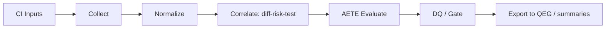

# BluePrint

## 1. 背景と問題定義

`harness-auto-test-evidence` は、単体でテスト結果を表示するツールではなく、  
自動テストの証跡を `diff / risk / test / evidence` の関係で構造化する
**品質証跡ハーネス**として実装する。

現時点では「収集しレポート化する」状態であり、  
`code-to-gate` と手動観点系（`manual-bb-test-harness`）が定義する対象を
実行証跡側から埋める段階に入る段階である。

本 Blueprint は、以下を実装準備として固定する。

- 何を収集するか（I/O）
- どの粒度で正規化するか（schema）
- どの条件で DQ 化するか（自動失格ルール）
- 誰に受け渡すか（QEG / Gate）

## 2. Scope

### In

- GitHub Actions provenance の取得
- JUnit / OTR / Playwright / pytest / Vitest / Jest などの結果正規化
- LCOV / Cobertura / JaCoCo / coverage.py context の正規化
- SARIF、Pact、Stryker（mutation）結果の取り込み
- Playwright 生成アーティファクト（trace / screenshot / video / log）の
  manifest 管理
- AETE（自動証跡信頼評価）の実装準備
- QEG 向け `evidence graph` 出力の準備

### Out

- `quality-evidence-graph` 本体の実装
- QEG の Gate policy / waiver / approval / retention / immutability / schema
  migration の再実装
- 外部 SaaS（Codecov / ReportPortal / SonarQube）UI の独自運用部分
- 手動テスト実施そのものの代替

## 3. 主要前提

- 既存資産と重複責務を避ける  
  - `code-to-gate`: 何をテストすべきかの起点  
  - `manual-bb-test-harness`: manual 観点とリスク起点  
  - `quality-evidence-graph`: 判定/監査の最終統制
- QEG は trust / provenance / sourceRefs / DQ 優先 / waiver / approval /
  retention / immutability / schema hardening / fixture regression を担う。
  HATE はそれらを再実装せず、自動テスト証跡を QEG が検証できる形へ
  正規化する前段に集中する
- `coverage` は Evidence の「一要素」であり、主評価軸にはしない
- RanD / KanoMode の `requirements_packet.json` と
  `requirements_audit_packet.json` を、要求妥当性・検収可能性・外部証跡の
  入力として扱えるようにする。HATE は RanD の要件判定を再実装せず、
  自動テスト証跡が RanD の要求監査結果をどこまで支えているかを結線する
- `shipyard-cp` は `plan -> dev -> acceptance -> integrate -> publish` の
  run / gate / audit 統制層として扱う。HATE は Shipyard の state machine を
  再実装せず、RunSystemPacket / WorkerResult / audit event に添付できる
  自動テスト evidence bundle を生成する
- `workflow-cookbook` は実装運用の正本として扱う。HATE は Task Seed /
  Acceptance / Evidence / Birdseye / workflow plugin の checker を再実装せず、
  それらへ渡せる `workflow-*` artifact を生成する
- 外部サービス未導入でも、ローカル完結で主要機能が成立する
- 全 artifact / evidence には schema バージョンと provenance を持つ
- JSON / NDJSON record は共通 envelope を持ち、`schema_version`,
  `record_type`, `record_id`, `run_id`, `run_attempt`, `commit_sha`,
  `created_at`, `source_tool`, `source_version`, `sha256`,
  `redaction_status`, `payload` を基本フィールドとする
- 外部 SaaS 連携は non-gating optional とし、未設定でも P0 の
  local-first gate 判定を完了できる
- trace / screenshot / video / log は、hash だけでなく redaction 状態、
  retention、size、public exposure を manifest に残す
- adapter ごとの capability manifest を持ち、取得できない証跡粒度
  （flaky 判定、coverage context、artifact hash など）を明示する
- HATE 側の profile は QEG Gate policy ではなく、adapter / AETE / 自動テスト
  集約の profile として扱う。最終 Gate policy、waiver、approval は QEG に委譲する
- Playwright trace / screenshot / video / log は、public summary 出力前に
  artifact safety の対象とし、classification と redaction rule version を残す
- flaky / stale / baseline 差分のため、将来の history index を前提に
  run 単位の record と履歴参照を分離する
- matrix / shard / retry の集約規則を持ち、同一 test case の複数結果を
  `stable`, `flaky`, `failed`, `inconclusive` などへ決定的に畳み込む
- coverage / SARIF / JUnit / Playwright artifact の path は、workspace 相対、
  container path、Windows path、package root の差を正規化してから QEG へ渡す

## 3.1 QEG との責務境界

HATE は QEG の optional evidence producer / normalizer として振る舞う。
HATE が出す `qeg-bundle.json` や optional evidence は、QEG の
`validate / gate / record` と fixture regression で検証されることを前提にする。

| 領域 | HATE の責務 | QEG の責務 |
|---|---|---|
| 自動テスト ingest | JUnit / coverage / SARIF / Playwright / Pact / Stryker を収集・正規化 | optional evidence として graph / placement / Gate へ統合 |
| 信頼評価 | flaky、retry、matrix、coverage context、artifact availability を AETE に写像 | source-backed な Gate reason、DQ、blocker、residual risk を判定 |
| 統制 | QEG が読める provenance / hash / sourceRefs / manifest を出力 | Gate policy、waiver、approval、retention、immutability、schema hardening を統制 |
| 互換性 | QEG minimal fixture / optional evidence fixture を生成 | fixture regression で import / verdict / record を検証 |

## 3.2 RanD / shipyard-cp との客観性接続

HATE の AETE は自動テスト証跡の信頼度であり、要求そのものの価値や
運用フローの正しさを単独では保証しない。客観性を上げるため、次の
外部観測点を受け入れる。

| 連携先 | HATE で受け取るもの | HATE で行うこと | HATE がしないこと |
|---|---|---|---|
| RanD KanoMode | `requirements_packet.json`, `requirements_audit_packet.json`, `kano.json` | requirement / KPI / acceptance / risk / gate_verdict と test evidence を結線し、要件監査に対する自動テスト裏付け率を出す | Kano 分類、要求採択、Requirement Definition Gate の再判定 |
| shipyard-cp | `WorkerResult`, `RunSystemPacket`, task/run/audit refs, state transition refs | HATE 出力を run/audit に添付可能な evidence bundle として整形し、acceptance / integrate 前の客観証跡にする | Shipyard の state machine、worker dispatch、publish approval の再実装 |

この接続により、HATE の判断は「テストが通った」ではなく、
「RanD が監査した要求・受入条件に対して、Shipyard の run/audit 上で
再現可能な自動テスト証跡が存在する」という形で説明できる。

## 3.3 workflow-cookbook との実装接続

HATE の実装は `workflow-cookbook` の運用様式に載せる。HATE 側では
実装タスクと検収証跡を cookbook 形式へ渡せるよう、次を optional artifact
として生成する。

| 領域 | HATE artifact | 接続先 |
|---|---|---|
| Task Seed | `workflow-task-seed.json` | `TASK.codex.md`, `docs/tasks/*.md` |
| Acceptance | `workflow-acceptance-record.json` | `docs/acceptance/AC-YYYYMMDD-xx.md` |
| Evidence | `workflow-evidence.jsonl` | `agent-protocols` Evidence / workflow evidence report |
| Docs freshness | `workflow-docs-stale.json` | workflow plugin docs stale check / memx-resolver |
| Birdseye | `workflow-birdseye-map.json` | `docs/birdseye/index.json`, `caps/*.json` 候補 |

詳細契約は `docs/process/WORKFLOW_COOKBOOK_INTEGRATION.md` を正本とする。

## 4. I/O Contract

### 入力

- CI context
  - `GITHUB_WORKFLOW` / `GITHUB_RUN_ID` / `GITHUB_RUN_ATTEMPT` / `GITHUB_SHA` / `GITHUB_EVENT_PATH`
- 要求・監査 context
  - RanD `requirements_packet.json`
  - RanD `requirements_audit_packet.json`
  - RanD `kano.json`
- orchestration context
  - shipyard-cp `WorkerResult`
  - shipyard-cp `RunSystemPacket`
  - shipyard-cp task / run / audit event refs
- workflow context
  - workflow-cookbook Task Seed / Acceptance / Evidence conventions
  - workflow plugin docs resolve / stale check result
  - Birdseye / Codemap node metadata
- 自動テスト結果
  - `junit.xml` 系（Playwright/Jest/pytest/Vitest/JUnit）
- カバレッジ
  - `lcov` / `Cobertura XML` / `JaCoCo XML` / `coverage.py context`
- 静的・契約・適合性
  - `SARIF`, `Pact verification`, `Stryker report`, `playwright attachments`

### 出力

- 正規化 artifact（NDJSON / JSON）
  - `HATE-run.json`
  - `HATE-test-results.ndjson`
  - `HATE-coverage.ndjson`
  - `HATE-static.sarif`
  - `HATE-contract.ndjson`
  - `HATE-mutation.ndjson`
  - `artifact-manifest.json`
  - `diff-risk-test.json`
  - `risk-coverage-matrix.json`
  - `requirement-evidence-alignment.json`
  - `evidence-map.json`
  - `shipyard-run-evidence.json`
  - `workflow-task-seed.json`
  - `workflow-acceptance-record.json`
  - `workflow-evidence.jsonl`
  - `workflow-docs-stale.json`
  - `workflow-birdseye-map.json`
  - `aete-score.json`
  - `gate-decision.json`
  - `qeg-bundle.json`（QEG import 送信用）
  - `record.json`（own-output validation）

### 共通 record envelope

すべての JSON / NDJSON record は、最低限次の envelope を持つ。

```yaml
schema_version: HATE/v1
record_type: run | test_result | coverage_slice | evidence_ref | gate_decision | audit_record
record_id: string
run_id: string
run_attempt: number
commit_sha: string
created_at: ISO-8601 timestamp
source_tool: string
source_version: string
sha256: string
redaction_status: not_required | redacted | pending | failed
payload: object
```

## 5. 最小フロー



## 6. 実装準備の制約（優先順位）

### P0（MVP）

#### P0a（最小成立）

- GitHub Actions provenance
- 共通 record envelope
- JUnit 入力
- coverage（LCOV）
- `artifact-manifest.json`
- `gate-decision.json`
- `record.json`

#### P0b（QEG 連携成立）

- GitHub Actions provenance
- JUnit 入力
- coverage（LCOV/Cobertura/JaCoCo）
- SARIF
- Playwright artifact（trace/screenshot/video）
- QEG export
- `diff-risk-test.json`
- QEG minimal fixture

### P1

- coverage.py context
- Pact / can-i-deploy
- Stryker
- RanD requirements packet / audit packet ingest
- requirement-evidence alignment
- shipyard-cp RunSystemPacket / WorkerResult mapping
- workflow-cookbook Task Seed / Acceptance / Evidence artifact mapping
- workflow docs stale / Birdseye map artifact mapping
- AETE 8 次元 rubric（0 / 1 / 3 / 5 離散値）
- OpenTelemetry export
- adapter capability manifest
- adapter / AETE profile
- baseline / history index
- evidence explain / gap recommendation
- requirements audit explain（要件監査 issue と自動テスト証跡の対応説明）
- matrix / shard / retry aggregation
- path normalization contract

### P2

- Allure / ReportPortal / Codecov / SonarQube adapter（non-gating optional）
- 高度な可視化ダッシュボード

## 7. 成果条件（実装前）

- `AETE` の 8 次元評価定義を `task` として分解済み
- `DQ` の最低実装対象を HATE-DQ-01, 02, 03, 05, 07, 10, 15 とし、
  `hard_dq` / `soft_gap` の gate 影響を定義済み
- 共通 record envelope と artifact manifest の安全性項目を受入条件へ反映済み
- `artifact-manifest.json` の安全性項目に `classification`,
  `redaction_rule_version`, `safe_for_summary` を含める
- HATE adapter / AETE profile ごとの `hard_dq` / `soft_gap` / manual 補完条件を
  fixture で検証でき、最終 Gate policy は QEG に委譲されている
- QEG export は minimal valid bundle fixture で互換性を確認できる
- matrix / shard / retry aggregation と path normalization を受入条件へ反映済み
- RanD audit packet と HATE evidence map の結線により、要件ごとの
  testability / implementation_alignment / evidence coverage を説明できる
- shipyard-cp の run / audit refs へ HATE 出力を添付でき、acceptance /
  integrate 前の客観証跡として使える
- workflow-cookbook の Task Seed / Acceptance / Evidence / Birdseye へ渡せる
  `workflow-*` artifact が定義済み
- 受入項目を `EVALUATION.md` と整合させる
- `TASK.codex.md` で実作業タスクを完了順に並列化可能にする
