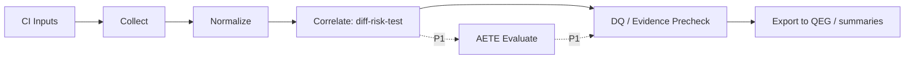

# BluePrint

## 1. 背景と問題定義

`harness-auto-test-evidence` は、単体でテスト結果を表示するツールではなく、  
自動テストの証跡を `diff / risk / test / evidence` の関係で構造化する
**品質証跡ハーネス**として実装する。

現時点では「収集しレポート化する」状態であり、  
`code-to-gate` と手動観点系（`manual-bb-test-harness`）が定義する対象を
実行証跡側から埋める段階に入る段階である。

本 Blueprint は、以下を実装準備として固定する。

- 何を収集するか（I/O）
- どの粒度で正規化するか（schema）
- どの条件で DQ 化するか（自動失格ルール）
- 誰に受け渡すか（QEG / 後段 Gate）

## 2. Scope

### In

- GitHub Actions provenance の取得
- JUnit / OTR / Playwright / pytest / Vitest / Jest などの結果正規化
- LCOV / Cobertura / JaCoCo / coverage.py context の正規化
- SARIF、Pact、Stryker（mutation）結果の取り込み
- Playwright 生成アーティファクト（trace / screenshot / video / log）の
  manifest 管理
- AETE（自動証跡信頼評価）の実装準備
- QEG 向け `evidence graph` 出力の準備
- enterprise-ready なプロダクト水準へ引き上げるための product readiness 要件整理

### Out

- `quality-evidence-graph` 本体の実装
- QEG の Gate policy / waiver / approval / retention / immutability / schema
  migration の再実装
- 外部 SaaS（Codecov / ReportPortal / SonarQube）UI の独自運用部分
- 手動テスト実施そのものの代替
- QEG / ALM / test management suite / incident management system の再実装

## 3. 主要前提

- 既存資産と重複責務を避ける  
  - `code-to-gate`: 何をテストすべきかの起点  
  - `manual-bb-test-harness`: manual 観点とリスク起点  
  - `quality-evidence-graph`: 判定/監査の最終統制
- QEG は trust / provenance / sourceRefs / DQ 優先 / waiver / approval /
  retention / immutability / schema hardening / fixture regression を担う。
  HATE はそれらを再実装せず、自動テスト証跡を QEG が検証できる形へ
  正規化する前段に集中する
- `coverage` は Evidence の「一要素」であり、主評価軸にはしない
- RanD / KanoMode の `requirements_packet.json` と
  `requirements_audit_packet.json` を、要求妥当性・検収可能性・外部証跡の
  入力として扱えるようにする。HATE は RanD の要件判定を再実装せず、
  自動テスト証跡が RanD の要求監査結果をどこまで支えているかを結線する
- `shipyard-cp` は `plan -> dev -> acceptance -> integrate -> publish` の
  run / gate / audit 統制層として扱う。HATE は Shipyard の state machine を
  再実装せず、RunSystemPacket / WorkerResult / audit event に添付できる
  自動テスト evidence bundle を生成する
- `workflow-cookbook` は実装運用の正本として扱う。HATE は Task Seed /
  Acceptance / Evidence / Birdseye / workflow plugin の checker を再実装せず、
  それらへ渡せる `workflow-*` artifact を生成する
- 外部サービス未導入でも、ローカル完結で主要機能が成立する
- 全 artifact / evidence には schema バージョンと provenance を持つ
- JSON / NDJSON record は共通 envelope を持ち、`schema_version`,
  `record_type`, `record_id`, `run_id`, `run_attempt`, `commit_sha`,
  `created_at`, `source_tool`, `source_version`, `sha256`,
  `redaction_status`, `payload` を基本フィールドとする
- 外部 SaaS 連携は non-gating optional とし、未設定でも P0 の
  local-first precheck 判定を完了できる
- trace / screenshot / video / log は、hash だけでなく redaction 状態、
  retention、size、public exposure を manifest に残す
- trace / screenshot / video / log は、secret scan、MIME / 拡張子整合、
  archive 展開制限、symlink / path traversal、外部 URL 参照の安全確認を通し、
  失敗時は public summary と QEG export の参照から除外する
- adapter ごとの capability manifest を持ち、取得できない証跡粒度
  （flaky 判定、coverage context、artifact hash など）を明示する
- HATE 側の profile は QEG Gate policy ではなく、adapter / AETE / 自動テスト
  集約の profile として扱う。最終 Gate policy、waiver、approval は QEG に委譲する
- AETE score には `rubric_version`, `profile_version`, `score_confidence`,
  `calibration_status` を持たせ、未校正の点数を release Gate の客観判定として
  誤用しない
- replay / compare / explain / recommend などの拡張 CLI は、HATE の
  local-first evidence bundle を再利用する補助機能として扱い、P0 の
  collect / normalize / precheck / QEG export を肥大化させない
- `HATE doctor` は adapter / schema / path / provenance / QEG fixture の
  事前診断として扱い、release Gate 判定や QEG validate の代替にしない
- artifact resolver は local path、CI artifact URL、Windows path、
  container path、workspace 相対 path を同じ規則で解決し、summary と
  QEG export の参照ずれを防ぐ
- schema registry は `HATE/v1` JSON Schema、互換性テスト、
  deprecated field 方針を管理し、QEG export 前の schema drift を検出する
- adapter conformance fixtures は正常・破損・欠損・retry/matrix 混在の
  fixture を adapter ごとに持ち、capability manifest と合わせて検証する
- Playwright trace / screenshot / video / log は、public summary 出力前に
  artifact safety の対象とし、classification と redaction rule version を残す
- flaky / stale / baseline 差分のため、将来の history index を前提に
  run 単位の record と履歴参照を分離する
- テスト履歴の混線を避けるため、adapter は `canonical_test_id`,
  `identity_components`, `aliases` を扱い、rename、parameterized test、
  matrix で test identity が揺れた場合も追跡できるようにする
- matrix / shard / retry の集約規則を持ち、同一 test case の複数結果を
  `stable`, `flaky`, `failed`, `inconclusive` などへ決定的に畳み込む
- coverage / SARIF / JUnit / Playwright artifact の path は、workspace 相対、
  container path、Windows path、package root の差を正規化してから QEG へ渡す
- Enterprise product readiness の正本は `docs/process/ENTERPRISE_PRODUCT_REQUIREMENTS.md` とする。
  HATE の商用化・enterprise・compliance・support 要件はこの文書に集約し、
  P0/P1 の local-first precheck / QEG export を肥大化させない
- Enterprise domain model の正本は `docs/process/ENTERPRISE_DOMAIN_MODEL.md` とする。
  org / workspace / project / repo / run / bundle / profile / audit event の
  scope 境界はこの文書に従う
- Product error taxonomy の正本は `docs/process/PRODUCT_ERROR_TAXONOMY.md` とする。
  user-facing failure、remediation、diagnostic bundle の契約はこの文書に従う
- Schema registry の正本は `docs/process/SCHEMA_REGISTRY_CONTRACT.md` とする。
  required / optional / nullable / deprecated / unknown field policy はこの文書に従う
- Adapter SDK の正本は `docs/process/ADAPTER_SDK_CONTRACT.md` とする。
  adapter manifest、required interface、failure contract、conformance fixtures は
  この文書に従う
- Risk debt register の正本は `docs/process/RISK_DEBT_REGISTER.md` とする。
  soft gap、manual 補完要求、conditional candidate の継続追跡はこの文書に従う
- Privacy / quarantine の正本は `docs/process/PRIVACY_QUARANTINE_CONTRACT.md` とする。
  artifact safety、privacy report、quarantine、summary/export 制御はこの文書に従う
- Hosted read model / API の正本は `docs/process/HOSTED_READ_MODEL_API.md` とする。
  dashboard、REST API、RBAC、cache、read model consistency はこの文書に従う
- Release / migration の正本は `docs/process/RELEASE_MIGRATION_POLICY.md` とする。
  release channel、deprecation、migration artifact、rollback、compatibility matrix は
  この文書に従う
- Packaging / entitlement の正本は `docs/process/PACKAGING_ENTITLEMENT_CONTRACT.md` とする。
  edition、entitlement、usage meter、over-limit、procurement artifact はこの文書に従う
- Customer documentation の正本は `docs/process/CUSTOMER_DOCUMENTATION_CONTRACT.md` とする。
  customer-facing docs、audience、freshness、verification、source contract はこの文書に従う
- SLO / incident response の正本は `docs/process/SLO_INCIDENT_RESPONSE_CONTRACT.md` とする。
  hosted SLO、incident class、status communication、containment、postmortem はこの文書に従う
- Customer success / adoption の正本は `docs/process/CUSTOMER_SUCCESS_ADOPTION_CONTRACT.md` とする。
  onboarding、adoption stage、success plan、renewal readiness はこの文書に従う
- Security review / trust の正本は `docs/process/SECURITY_REVIEW_TRUST_CONTRACT.md` とする。
  trust packet、control mapping、vulnerability handling、review record はこの文書に従う
- Product telemetry / analytics の正本は `docs/process/PRODUCT_TELEMETRY_ANALYTICS_CONTRACT.md` とする。
  opt-in telemetry、allowed signal、prohibited signal、analytics outputs はこの文書に従う
- Data residency / deployment の正本は `docs/process/DATA_RESIDENCY_DEPLOYMENT_CONTRACT.md` とする。
  deployment mode、residency profile、data class routing、backup / recovery はこの文書に従う
- Product governance / roadmap の正本は `docs/process/PRODUCT_GOVERNANCE_ROADMAP_CONTRACT.md` とする。
  roadmap item、decision record、customer request、deprecation decision はこの文書に従う
- Accessibility / localization の正本は `docs/process/ACCESSIBILITY_LOCALIZATION_CONTRACT.md` とする。
  accessibility target、locale fallback、message catalog、translated docs はこの文書に従う
- Legal / commercial contracting の正本は `docs/process/LEGAL_COMMERCIAL_CONTRACTING_CONTRACT.md` とする。
  commercial commitment、procurement response、contract exception、renewal risk はこの文書に従う
- Audit fixture / assurance の正本は `docs/process/AUDIT_FIXTURE_ASSURANCE_CONTRACT.md` とする。
  audit fixture、assurance pack、auditor walkthrough、evidence room はこの文書に従う
- Requirements portfolio の正本は `docs/process/REQUIREMENTS_PORTFOLIO_OPERATING_MODEL.md` とする。
  tier、stage、WIP、dependency、portfolio health はこの文書に従う
- P0a golden path の正本は `docs/process/P0A_GOLDEN_PATH.md` とする。
  `fixtures/golden/p0a-minimal`、必須入力、必須出力、decision enum、
  DQ fixture、summary safety をこの契約に従わせる

## 3.1 QEG との責務境界

HATE は QEG の optional evidence producer / normalizer として振る舞う。
HATE が出す `qeg-bundle.json` や optional evidence は、QEG の
`validate / gate / record` と fixture regression で検証されることを前提にする。

| 領域 | HATE の責務 | QEG の責務 |
|---|---|---|
| 自動テスト ingest | JUnit / coverage / SARIF / Playwright / Pact / Stryker を収集・正規化 | optional evidence として graph / placement / Gate へ統合 |
| 信頼評価 | flaky、retry、matrix、coverage context、artifact availability を AETE に写像 | source-backed な Gate reason、DQ、blocker、residual risk を判定 |
| Evidence strength | run 履歴・retry/replay の pass/fail 遷移と mutation evidence から `evidence_strength` を算出し、unknown を明示して export | strength のしきい値、policy 判断、go/hold/block への反映 |
| 統制 | QEG が読める provenance / hash / sourceRefs / manifest を出力 | Gate policy、waiver、approval、retention、immutability、schema hardening を統制 |
| 互換性 | QEG minimal fixture / optional evidence fixture を生成 | fixture regression で import / verdict / record を検証 |

## 3.2 RanD / shipyard-cp との客観性接続

HATE の AETE は自動テスト証跡の信頼度であり、要求そのものの価値や
運用フローの正しさを単独では保証しない。客観性を上げるため、次の
外部観測点を受け入れる。

| 連携先 | HATE で受け取るもの | HATE で行うこと | HATE がしないこと |
|---|---|---|---|
| RanD KanoMode | `requirements_packet.json`, `requirements_audit_packet.json`, `kano.json` | requirement / KPI / acceptance / risk / gate_verdict と test evidence を結線し、要件監査に対する自動テスト裏付け率を出す | Kano 分類、要求採択、Requirement Definition Gate の再判定 |
| shipyard-cp | `WorkerResult`, `RunSystemPacket`, task/run/audit refs, state transition refs | HATE 出力を run/audit に添付可能な evidence bundle として整形し、acceptance / integrate 前の客観証跡にする | Shipyard の state machine、worker dispatch、publish approval の再実装 |

この接続により、HATE の判断は「テストが通った」ではなく、
「RanD が監査した要求・受入条件に対して、Shipyard の run/audit 上で
再現可能な自動テスト証跡が存在する」という形で説明できる。

## 3.3 workflow-cookbook との実装接続

HATE の実装は `workflow-cookbook` の運用様式に載せる。HATE 側では
実装タスクと検収証跡を cookbook 形式へ渡せるよう、次を optional artifact
として生成する。

| 領域 | HATE artifact | 接続先 |
|---|---|---|
| Task Seed | `workflow-task-seed.json` | `TASK.codex.md`, `docs/tasks/*.md` |
| Acceptance | `workflow-acceptance-record.json` | `docs/acceptance/AC-YYYYMMDD-xx.md` |
| Evidence | `workflow-evidence.jsonl` | `agent-protocols` Evidence / workflow evidence report |
| Docs freshness | `workflow-docs-stale.json` | workflow plugin docs stale check / memx-resolver |
| Birdseye | `workflow-birdseye-map.json` | `docs/birdseye/index.json`, `caps/*.json` 候補 |

詳細契約は `docs/process/WORKFLOW_COOKBOOK_INTEGRATION.md` を正本とする。

## 3.4 Enterprise product readiness

HATE は技術ハーネスに留まらず、規制産業・大規模 platform team の
調達と監査に耐える製品として育てる。ただし、productization は local-first
証跡契約を壊さない範囲で進める。

| 領域 | 正本 | HATE で固定すること |
|---|---|---|
| Product requirements | `ENTERPRISE_PRODUCT_REQUIREMENTS.md` | ICP、persona、surface、edition、product gate |
| P0a golden path | `P0A_GOLDEN_PATH.md` | minimal fixture、expected outputs、decision enum、PRG-0 evidence |
| Domain model | `ENTERPRISE_DOMAIN_MODEL.md` | org、workspace、project、repo、run、bundle、profile、audit event |
| Error taxonomy | `PRODUCT_ERROR_TAXONOMY.md` | stable error code、remediation、diagnostic bundle |
| Schema registry | `SCHEMA_REGISTRY_CONTRACT.md` | schema version、field policy、fixture compatibility、migration |
| Adapter SDK | `ADAPTER_SDK_CONTRACT.md` | adapter manifest、interface、failure contract、conformance |
| Risk debt | `RISK_DEBT_REGISTER.md` | soft gap、manual 補完、owner、age、recommended action |
| Privacy / quarantine | `PRIVACY_QUARANTINE_CONTRACT.md` | artifact safety、privacy report、quarantine、summary/export 制御 |
| Hosted read model | `HOSTED_READ_MODEL_API.md` | REST API、dashboard、cache、RBAC、read model source |
| Release / migration | `RELEASE_MIGRATION_POLICY.md` | release gates、migration artifacts、rollback、compatibility matrix |
| Packaging / entitlement | `PACKAGING_ENTITLEMENT_CONTRACT.md` | edition、entitlement、usage meter、over-limit、procurement artifact |
| Customer documentation | `CUSTOMER_DOCUMENTATION_CONTRACT.md` | docs audience、required docs、freshness、verification、source contract |
| SLO / incident response | `SLO_INCIDENT_RESPONSE_CONTRACT.md` | SLO、incident class、status communication、containment、postmortem |
| Customer success / adoption | `CUSTOMER_SUCCESS_ADOPTION_CONTRACT.md` | onboarding、success plan、adoption health、renewal readiness |
| Security review / trust | `SECURITY_REVIEW_TRUST_CONTRACT.md` | trust packet、control mapping、SBOM、vulnerability handling |
| Product telemetry / analytics | `PRODUCT_TELEMETRY_ANALYTICS_CONTRACT.md` | opt-in telemetry、allowed signal、privacy boundary、analytics outputs |
| Data residency / deployment | `DATA_RESIDENCY_DEPLOYMENT_CONTRACT.md` | deployment mode、residency profile、data routing、backup / recovery |
| Product governance / roadmap | `PRODUCT_GOVERNANCE_ROADMAP_CONTRACT.md` | roadmap item、decision record、customer request、deprecation decision |
| Accessibility / localization | `ACCESSIBILITY_LOCALIZATION_CONTRACT.md` | accessibility report、message catalog、locale fallback、translated docs |
| Legal / commercial contracting | `LEGAL_COMMERCIAL_CONTRACTING_CONTRACT.md` | commitment register、procurement response、contract exception、renewal risk |
| Audit fixture / assurance | `AUDIT_FIXTURE_ASSURANCE_CONTRACT.md` | audit fixture、assurance pack、walkthrough、evidence room |
| Requirements portfolio | `REQUIREMENTS_PORTFOLIO_OPERATING_MODEL.md` | tier、stage、WIP limit、dependency、portfolio health |
| Enterprise controls | `ENTERPRISE_PRODUCT_REQUIREMENTS.md` | RBAC、audit log、retention、SSO / SCIM、supportability |
| Compliance readiness | `ENTERPRISE_PRODUCT_REQUIREMENTS.md` | control mapping、legal hold、attestation、diagnostic bundle |
| Product metrics | `ENTERPRISE_PRODUCT_REQUIREMENTS.md` | Time to First Evidence、eligibility、risk debt、replay reproducibility |

Enterprise product readiness は QEG の Gate policy を置き換えない。HATE は
enterprise dashboard や admin console を持つ場合でも、判定正本ではなく
検証可能な evidence bundle と metadata を生成する前段であり続ける。

## 4. I/O Contract

### 入力

- CI context
  - `GITHUB_WORKFLOW` / `GITHUB_RUN_ID` / `GITHUB_RUN_ATTEMPT` / `GITHUB_SHA` / `GITHUB_EVENT_PATH`
- 要求・監査 context
  - RanD `requirements_packet.json`
  - RanD `requirements_audit_packet.json`
  - RanD `kano.json`
- orchestration context
  - shipyard-cp `WorkerResult`
  - shipyard-cp `RunSystemPacket`
  - shipyard-cp task / run / audit event refs
- workflow context
  - workflow-cookbook Task Seed / Acceptance / Evidence conventions
  - workflow plugin docs resolve / stale check result
  - Birdseye / Codemap node metadata
- 自動テスト結果
  - `junit.xml` 系（Playwright/Jest/pytest/Vitest/JUnit）
- カバレッジ
  - `lcov` / `Cobertura XML` / `JaCoCo XML` / `coverage.py context`
- 静的・契約・適合性
  - `SARIF`, `Pact verification`, `Stryker report`, `playwright attachments`

### 出力

- 正規化 artifact（NDJSON / JSON）
  - `HATE-run.json`
  - `HATE-test-results.ndjson`
  - `HATE-coverage.ndjson`
  - `HATE-static.sarif`
  - `HATE-contract.ndjson`
  - `HATE-mutation.ndjson`
  - `artifact-manifest.json`
  - `diff-risk-test.json`
  - `risk-coverage-matrix.json`
  - `requirement-evidence-alignment.json`
  - `evidence-map.json`
  - `risk-debt-register.json`
  - `shipyard-run-evidence.json`
  - `workflow-task-seed.json`
  - `workflow-acceptance-record.json`
  - `workflow-evidence.jsonl`
  - `workflow-docs-stale.json`
  - `workflow-birdseye-map.json`
  - `doctor-report.json`
  - `artifact-resolver-map.json`
  - `privacy-report.json`
  - `quarantine-report.json`
  - `schema-registry.json`
  - `adapter-conformance-report.json`
  - `entitlement-manifest.json`
  - `usage-report.json`
  - `customer-docs-index.json`
  - `incident-record.json`
  - `slo-report.json`
  - `adoption-plan.json`
  - `adoption-health-report.json`
  - `renewal-readiness.json`
  - `security-review-record.json`
  - `trust-packet-index.json`
  - `telemetry-event.jsonl`
  - `product-metrics-report.json`
  - `residency-profile.json`
  - `deployment-topology.json`
  - `roadmap-item.json`
  - `product-decision-record.md`
  - `accessibility-report.json`
  - `localization-report.json`
  - `commercial-commitment-register.json`
  - `contract-exception-register.json`
  - `audit-fixture-manifest.json`
  - `assurance-summary.md`
  - `requirements-portfolio.json`
  - `portfolio-health-report.json`
  - `aete-score.json`
  - `precheck-decision.json`（HATE precheck。release Gate 正本ではない）
  - `gate-decision.json`（互換 alias。新規実装では `precheck-decision.json` を優先）
  - `qeg-bundle.json`（QEG import 送信用）
- `record.json`（own-output validation）
- `product-readiness-report.json`（P2/P3 product readiness の検査結果）

### 共通 record envelope

すべての JSON / NDJSON record は、最低限次の envelope を持つ。

```yaml
schema_version: HATE/v1
record_type: run | test_result | coverage_slice | evidence_ref | precheck_decision | gate_decision | audit_record | requirement_alignment | shipyard_run_evidence | workflow_task_seed | workflow_acceptance | workflow_evidence | workflow_docs_stale | workflow_birdseye_map | doctor_report | artifact_resolution | schema_registry | adapter_conformance | entitlement_manifest | usage_report | customer_docs_index | incident_record | slo_report | adoption_plan | adoption_health_report | security_review_record | trust_packet_index | telemetry_event | product_metrics_report | residency_profile | deployment_topology | roadmap_item | accessibility_report | localization_report | commercial_commitment | contract_exception | audit_fixture_manifest | assurance_pack | requirements_portfolio_item | portfolio_health_report | product_readiness_report
record_id: string
run_id: string
run_attempt: number
commit_sha: string
created_at: ISO-8601 timestamp
source_tool: string
source_version: string
sha256: string
redaction_status: not_required | redacted | pending | failed
payload: object
```

## 5. 最小フロー



## 6. 実装準備の制約（優先順位）

### P0（MVP）

#### P0a（最小成立）

- GitHub Actions provenance
- 共通 record envelope
- JUnit 入力
- coverage（LCOV）
- `artifact-manifest.json`
- `precheck-decision.json`（HATE precheck）
- `gate-decision.json`（互換 alias）
- `record.json`
- `summary.md`
- `fixtures/golden/p0a-minimal`

#### P0b（QEG 連携成立）

- GitHub Actions provenance
- JUnit 入力
- coverage（LCOV/Cobertura/JaCoCo）
- SARIF
- Playwright artifact（trace/screenshot/video）
- QEG export
- `diff-risk-test.json`
- QEG minimal fixture

### P1

#### P1a（信頼評価 hardening）

P1a は肥大化を避けるため、以下の 3 つの小フェーズに分ける。

- P1a-1: 診断基盤（adapter capability / registry、schema registry、
  adapter conformance fixtures、artifact resolver、HATE doctor）
- P1a-2: 再現性（canonical test identity、baseline / history index、
  matrix / shard / retry aggregation、replay / compare）
- P1a-3: 説明と改善（AETE score confidence、explain、recommend、
  profile inheritance、manual 補完候補の根拠出力）

- coverage.py context
- Pact / can-i-deploy
- Stryker
- AETE 8 次元 rubric（0 / 1 / 3 / 5 離散値）
- OpenTelemetry export
- adapter capability manifest
- adapter / AETE profile
- baseline / history index
- evidence explain / gap recommendation
- replay / compare による frozen bundle 再計算と trust delta 可視化
- HATE doctor による adapter / schema / path / provenance / QEG fixture 診断
- artifact resolver による artifact 参照の一貫解決
- schema registry による JSON Schema / 互換性 / deprecated field 管理
- adapter conformance fixtures による adapter 最低準拠の検証
- adapter registry
- profile inheritance
- risk debt register
- matrix / shard / retry aggregation
- path normalization contract

#### P1b（外部運用接続）

- RanD requirements packet / audit packet ingest
- requirement-evidence alignment
- shipyard-cp RunSystemPacket / WorkerResult mapping
- workflow-cookbook Task Seed / Acceptance / Evidence artifact mapping
- workflow docs stale / Birdseye map artifact mapping
- requirements audit explain（要件監査 issue と自動テスト証跡の対応説明）
- manual-bb bridge（high-risk gap から manual 補完要求を生成）

### P2

- Allure / ReportPortal / Codecov / SonarQube adapter（non-gating optional）
- 高度な可視化ダッシュボード
- hosted dashboard / read model / REST API
- product error code taxonomy
- remediation catalog / support diagnostic bundle
- risk debt register
- privacy report / artifact quarantine
- release evidence / migration guide / compatibility matrix
- packaging / entitlement manifest / usage meter
- customer-facing docs index / docs verification
- SLO report / incident record
- customer success adoption plan / renewal readiness
- security review trust packet / control mapping
- product telemetry / analytics report
- data residency profile / deployment topology
- product governance roadmap item / decision record
- accessibility / localization report
- commercial commitment / contract exception register
- audit fixture manifest / assurance pack
- requirements portfolio / portfolio health report
- RBAC / audit log / retention policy の設計
- PR annotation export
- artifact budget report
- signed evidence / attestation

### P3（Enterprise product readiness）

- SSO / SCIM / service account / short-lived token
- SIEM / data warehouse / ticketing connector
- compliance control mapping / security review pack
- support diagnostic bundle / incident class / support SLA
- pricing / packaging / edition boundary
- procurement artifact / entitlement governance
- customer documentation program / freshness governance
- incident response / status communication / postmortem program
- customer success / rollout / renewal readiness program
- trust center / security review / vulnerability handling program
- privacy-preserving telemetry / product analytics governance
- data residency / private deployment / recovery program
- product governance / roadmap / advisory process
- accessibility / localization / inclusive docs program
- legal / commercial contracting / procurement response program
- audit fixture / assurance / evidence room program
- requirements portfolio / WIP / dependency governance
- legal hold / customer export / deletion request
- Enterprise Product Readiness Gate（PRG-6）の検査
- long-term support / release channel / rollback policy

## 7. 成果条件（実装前）

- `AETE` の 8 次元評価定義を P1a `task` として分解済み
- `DQ` の最低実装対象を HATE-DQ-01, 02, 03, 05, 07, 10, 15 とし、
  `hard_dq` / `soft_gap` の HATE precheck / QEG export への影響を定義済み
- 共通 record envelope と artifact manifest の安全性項目を受入条件へ反映済み
- `artifact-manifest.json` の安全性項目に `classification`,
  `redaction_rule_version`, `safe_for_summary` を含める
- artifact safety は redaction だけでなく、secret scan、MIME / 拡張子整合、
  archive 展開制限、symlink / path traversal、外部 URL 参照の検査を含む
- HATE adapter / AETE profile ごとの `hard_dq` / `soft_gap` / manual 補完条件を
  fixture で検証でき、最終 Gate policy は QEG に委譲されている
- AETE score は `rubric_version`, `profile_version`, `score_confidence`,
  `calibration_status` を持ち、点数の過信を避けられる
- test result は `canonical_test_id`, `identity_components`, `aliases` を持ち、
  rename / parameterized test / matrix による履歴断絶を抑制できる
- QEG export は minimal valid bundle fixture で互換性を確認できる
- matrix / shard / retry aggregation と path normalization を受入条件へ反映済み
- HATE doctor / artifact resolver / schema registry /
  adapter conformance fixtures を P1a の拡張候補として task と受入条件へ反映済み
- P1b で RanD audit packet と HATE evidence map の結線により、要件ごとの
  testability / implementation_alignment / evidence coverage を説明できる
- P1b で shipyard-cp の run / audit refs へ HATE 出力を添付でき、acceptance /
  integrate 前の客観証跡として使える
- P1b で workflow-cookbook の Task Seed / Acceptance / Evidence / Birdseye へ渡せる
  `workflow-*` artifact が定義済み
- `ENTERPRISE_PRODUCT_REQUIREMENTS.md` で ICP、persona、product surface、enterprise
  controls、supportability、product readiness gates が定義済み
- `ENTERPRISE_DOMAIN_MODEL.md` で account model、scope、RBAC、retention、
  audit event、read model が定義済み
- `PRODUCT_ERROR_TAXONOMY.md` で stable error code、remediation、summary policy、
  diagnostic bundle が定義済み
- `SCHEMA_REGISTRY_CONTRACT.md` で schema version、field policy、fixture matrix、
  migration policy が定義済み
- `ADAPTER_SDK_CONTRACT.md` で adapter manifest、required interface、failure contract、
  conformance fixtures が定義済み
- `RISK_DEBT_REGISTER.md` で risk debt item、status、aging、recommendation link が定義済み
- `PRIVACY_QUARANTINE_CONTRACT.md` で classification、safety check、
  privacy report、quarantine、output policy が定義済み
- `HOSTED_READ_MODEL_API.md` で API resource、response envelope、authorization、
  consistency rule が定義済み
- `RELEASE_MIGRATION_POLICY.md` で release channel、deprecation、migration artifact、
  release gate、rollback policy が定義済み
- `PACKAGING_ENTITLEMENT_CONTRACT.md` で edition、entitlement、usage meter、
  over-limit、procurement artifact が定義済み
- `CUSTOMER_DOCUMENTATION_CONTRACT.md` で audience、required docs、freshness、
  verification、source contract が定義済み
- `SLO_INCIDENT_RESPONSE_CONTRACT.md` で hosted SLO、incident class、severity、
  status communication、containment、postmortem が定義済み
- `CUSTOMER_SUCCESS_ADOPTION_CONTRACT.md` で onboarding、adoption stage、
  success plan、adoption health、renewal readiness が定義済み
- `SECURITY_REVIEW_TRUST_CONTRACT.md` で trust packet、security review record、
  control mapping、vulnerability handling、trust freshness が定義済み
- `PRODUCT_TELEMETRY_ANALYTICS_CONTRACT.md` で telemetry mode、allowed / prohibited signal、
  retention、analytics outputs、privacy boundary が定義済み
- `DATA_RESIDENCY_DEPLOYMENT_CONTRACT.md` で deployment mode、residency profile、
  data class routing、connectivity、backup / recovery が定義済み
- `PRODUCT_GOVERNANCE_ROADMAP_CONTRACT.md` で roadmap item、decision record、
  customer request、deprecation decision、roadmap communication が定義済み
- `ACCESSIBILITY_LOCALIZATION_CONTRACT.md` で accessibility target、localization、
  message catalog、accessibility / localization report が定義済み
- `LEGAL_COMMERCIAL_CONTRACTING_CONTRACT.md` で commercial commitment、
  procurement response、contract exception、commercial risk が定義済み
- `AUDIT_FIXTURE_ASSURANCE_CONTRACT.md` で audit fixture、assurance pack、
  evidence room、audit finding が定義済み
- `REQUIREMENTS_PORTFOLIO_OPERATING_MODEL.md` で portfolio tier、stage、WIP、
  prioritization rule、portfolio health が定義済み
- `P0A_GOLDEN_PATH.md` で P0a golden fixture、必須入力、必須出力、
  decision enum、DQ fixture、summary safety、PRG-0 evidence が定義済み
- P2/P3 の productization は P0/P1 の local-first precheck / QEG export と分離され、
  hosted dashboard や enterprise connector が未実装でも canonical bundle の
  再計算性を損なわない
- 受入項目を `EVALUATION.md` と整合させる
- `TASK.codex.md` で実作業タスクを完了順に並列化可能にする
