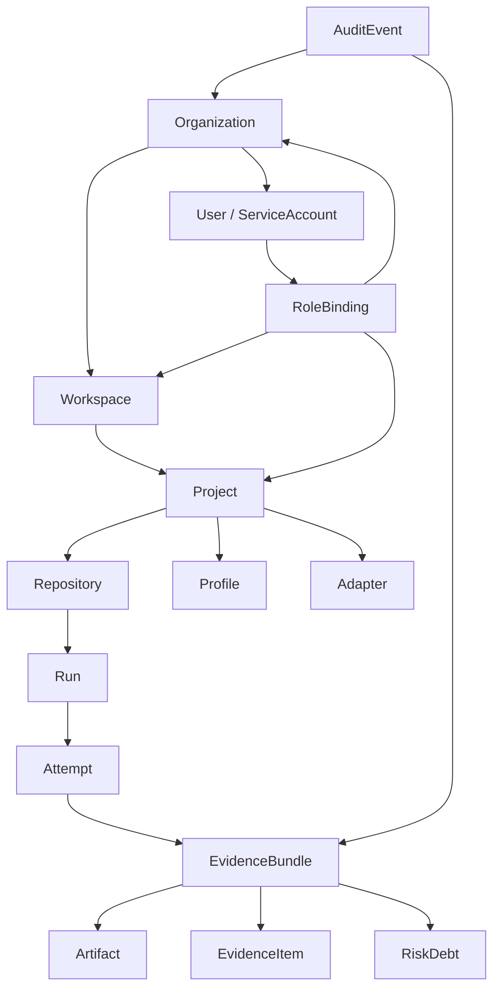

# Enterprise Domain Model

## 1. 目的

この文書は HATE を enterprise-ready なプロダクトとして運用するための
domain model を定義する。P0/P1 の local-first evidence bundle は単発 run として
成立するが、P2/P3 の dashboard、RBAC、audit log、retention、support では
account model と権限境界が必要になる。

この model は hosted service を必須にしない。local bundle から派生できる read model として
設計し、HATE が QEG の release Gate 正本を再実装しない責務境界を保つ。

## 2. Entity Overview

| Entity | 説明 | P0/P1 必須 |
|---|---|---|
| Organization | 契約、SSO、retention、billing、audit の最上位単位 | no |
| Workspace | org 内の部門、製品、事業単位 | no |
| Project | 複数 repo、QEG、workflow、shipyard 接続の単位 | no |
| Repository | source control repo | yes |
| Run | CI / local / agent 実行の単位 | yes |
| Attempt | rerun / retry / run_attempt の単位 | yes |
| EvidenceBundle | HATE が生成する immutable bundle | yes |
| Artifact | trace / screenshot / video / coverage / SARIF / log / report | yes |
| Profile | adapter / AETE / DQ / summary safety の設定 | yes |
| Adapter | ingest / normalize / export plugin | yes |
| EvidenceItem | normalized test / coverage / static / contract / mutation record | yes |
| RiskDebt | soft gap / manual 補完要求 / conditional candidate の追跡 | no |
| AuditEvent | profile 変更、export、artifact access、admin action | no |
| User | human user | no |
| ServiceAccount | CI / automation identity | no |
| RoleBinding | subject と role / scope の対応 | no |

## 3. Relationship Model

## 4. Stable Identifiers

| Entity | ID 例 | 安定性 |
|---|---|---|
| Organization | `org_RNA4219` | rename しても変えない |
| Workspace | `wsp_platform` | workspace 移動時は alias を持つ |
| Project | `prj_hate` | repo 群の論理単位 |
| Repository | `repo_owner_name` | VCS provider / repo id を sourceRef とする |
| Run | `run_1001` | CI provider run_id と対応 |
| Attempt | `attempt_1001_1` | run_id + run_attempt |
| EvidenceBundle | `bundle_sha256_<digest>` | content-addressed |
| Artifact | `art_<kind>_<digest>` | content-addressed |
| Profile | `profile_release_v1` | versioned |
| Adapter | `adapter_junit_v1` | adapter name + version |
| RiskDebt | `riskdebt_<risk_id>_<bundle_id>` | risk と bundle に束縛 |
| AuditEvent | `aud_<timestamp>_<seq>` | append-only |

## 5. Tenancy and Scope

| Scope | 含むもの | 境界 |
|---|---|---|
| Organization | users, service accounts, workspaces, billing, retention | 他 org と artifact / audit を混ぜない |
| Workspace | projects, shared profiles, dashboards | 部門別の権限分離 |
| Project | repositories, QEG connection, adapters, profiles | product / repo 群の品質単位 |
| Repository | runs, source refs, default profile | VCS repo 単位 |
| Run / Attempt | evidence bundle, artifacts, decision | 再現性と retry の単位 |

P0/P1 local execution では Organization / Workspace / Project を省略できる。
省略時は `local` scope として扱い、hosted read model に取り込む場合に明示的に
mapping する。

## 6. Role Model

| Role | できること | できないこと |
|---|---|---|
| Admin | org settings、retention、SSO、RBAC、connector 管理 | QEG の approval を HATE 内で代替する |
| Maintainer | project / repo / profile / adapter 管理 | org-wide retention の変更 |
| Developer | run / summary / recommendation の閲覧、local bundle 生成 | profile approval / audit log 変更 |
| Auditor | bundle / audit / read-only report の閲覧 | artifact mutation / profile change |
| Viewer | summary / dashboard 閲覧 | artifact raw access / export |
| ServiceAccount | CI から bundle 生成 / upload | human approval の代替 |

Auditor は read-only とする。HATE の Role は QEG の approval / waiver 権限とは別に扱う。

## 7. Data Classification

| Classification | 例 | 既定 summary 可否 | 既定 retention |
|---|---|---|---|
| public | aggregate count, generic summary | yes | 180 days |
| internal | repo-relative path, test names | conditional | 90 days |
| confidential | screenshot, trace, customer-like data | no | 30 days |
| restricted | secret, token, PII, regulated data | no | quarantine |

Artifact classification は `artifact-manifest.json` に記録し、summary / export /
diagnostic bundle の出力可否を制御する。

## 8. Retention Model

| Data | 既定 | 変更単位 |
|---|---:|---|
| canonical JSON / NDJSON | 180 days | org / project |
| summary.md / report | 180 days | org / project |
| coverage / SARIF | 90 days | org / project / artifact kind |
| trace / screenshot / video | 30 days | org / project / classification |
| diagnostic bundle | 14 days | org |
| audit log | 365 days | org |
| quarantine metadata | 365 days | org |

Retention は QEG の retention 正本を置き換えない。HATE は artifact metadata と
sourceRefs を出し、最終的な保持統制は接続先の policy に委譲できるようにする。

## 9. Audit Events

最低限、次の event を記録できるようにする。

| Event | Trigger | Required fields |
|---|---|---|
| `bundle.created` | evidence bundle 生成 | bundle_id, run_id, commit_sha, profile_hash |
| `bundle.exported` | QEG / external export | bundle_id, target, status |
| `profile.changed` | profile 変更 | profile_id, before_hash, after_hash, actor |
| `adapter.changed` | adapter 追加 / 更新 | adapter_id, version, actor |
| `artifact.accessed` | raw artifact access | artifact_id, actor, reason |
| `artifact.quarantined` | safety failure | artifact_id, reason, detector |
| `riskdebt.created` | soft gap / manual 補完要求 | risk_id, source_refs, owner |
| `diagnostic.generated` | support bundle 生成 | bundle_id, requester, redaction_status |

## 10. Read Model Requirements

Dashboard / REST API は canonical bundle から派生する read model とする。

| View | Source |
|---|---|
| Run list | `HATE-run.json`, `record.json` |
| Evidence map | `evidence-map.json`, `qeg-bundle.json` |
| Risk coverage matrix | `risk-coverage-matrix.json` |
| Artifact budget | `artifact-manifest.json` |
| DQ trend | `precheck-decision.json`, history index |
| Risk debt | `risk-debt-register.json` |
| Product readiness | `product-readiness-report.json` |
| Audit log | audit events |

Read model の不整合は canonical bundle を正とし、dashboard の値で
HATE precheck や QEG verdict を上書きしない。

## 11. Acceptance

- P0/P1 local bundle は org / workspace / hosted service なしで生成できる
- Hosted read model は canonical bundle から再構築できる
- org / workspace / project / repo / run / attempt の scope 境界が明確
- auditor role は read-only として表現できる
- service account は human approval の代替にならない
- artifact classification が summary / export / diagnostic bundle の出力可否に効く
- retention は artifact kind と classification に結びつく
- audit event は append-only として扱われる
