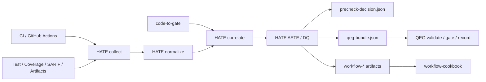

# HATE 仕様書

`SPEC_SCOPE_DECLARATION`: 本仕様書は `harness-auto-test-evidence` が自動テスト証跡を収集・正規化し、QEG optional evidence と workflow-cookbook 運用 artifact へ変換するための実装契約である。

## 1. 目的

`harness-auto-test-evidence`（HATE）は、CI 上で得られる自動テスト証跡を
`diff / risk / test / evidence` の関係で構造化し、QEG が検証できる
optional evidence bundle として出力する。

HATE は release Gate の正本ではない。HATE は自動テスト証跡の producer /
normalizer / evaluator / exporter であり、QEG の Gate policy、waiver、
approval、retention、immutability、schema migration、source-backed Gate
reason を再実装しない。

## 2. 正本関係

| 文書 | 役割 | 優先 |
|---|---|---:|
| `README.md` | repo 入口と責務境界 | 1 |
| `docs/process/BLUEPRINT.md` | 背景、Scope、I/O、実装フェーズ | 1 |
| `docs/process/SPECIFICATION.md` | 実装契約、データ契約、QEG / Workflow 接続 | 1 |
| `docs/process/FULL_IMPLEMENTATION_SPEC_GAP_CLOSURE.md` | フル実装に必要な不足仕様の解消正本 | 1 |
| `docs/process/IMPLEMENTATION_TASK_BREAKDOWN.md` | コード・schema・fixture・test・docsへ落とす実装タスク正本 | 1 |
| `docs/process/GUARDRAILS.md` | 禁止事項、責務分離、安全制約 | 1 |
| `docs/process/EVALUATION.md` | 受入条件、KPI、テスト観点 | 1 |
| `docs/process/RUNBOOK.md` | 実行手順、受理前確認、ロールバック | 2 |
| `docs/process/WORKFLOW_COOKBOOK_INTEGRATION.md` | Task Seed / Acceptance / Evidence / Birdseye 接続 | 2 |
| `docs/process/P0A_GOLDEN_PATH.md` | P0a golden fixture と最小実行契約 | 2 |
| `docs/process/P0B_QEG_EXPORT_IMPLEMENTATION_CONTRACT.md` | P0b QEG export 実装契約 | 2 |
| `docs/process/P1A_TRUST_HARDENING_IMPLEMENTATION_CONTRACT.md` | P1a trust hardening 実装契約 | 2 |
| `docs/process/FULL_IMPLEMENTATION_SPEC_READINESS_CONTRACT.md` | フル実装仕様 readiness 判定境界 | 2 |
| `docs/process/SCHEMA_REGISTRY_CONTRACT.md` | HATE/v1 schema と互換性方針 | 2 |
| `docs/process/SPECIFICATION_SHIPYARD_FULL_IMPLEMENTATION_DRAFT.md` | Shipyard-cp フル実装 task / gate ドラフト | 2 |
| `docs/process/SPECIFICATION_SHIPYARD_AUDIT.md` | Shipyard worker draft の監査証跡 | 2 |
| `docs/process/SPECIFICATION_COMPLETION_AUDIT.md` | Shipyard-cp 仕様書完成監査 | 2 |
| `docs/process/shipyard-run-evidence-p0a-cli-implementation.json` | Shipyard-cp P0a CLI 実装証跡 | 2 |
| `docs/process/shipyard-run-evidence-p0a-dq-fixtures.json` | Shipyard-cp P0a DQ fixture 実装証跡 | 2 |
| `docs/process/MANUAL_BB_GATE_FULL_IMPLEMENTATION.md` | フル実装 completion claim の manual-bb gate | 2 |
| `docs/process/RAND_KANO_MODE_FULL_IMPLEMENTATION_AUDIT.md` | RanD KanoMode によるフル実装要求監査 | 2 |
| `docs/process/RAND_KANO_MODE_FULL_IMPLEMENTATION_READINESS_GO.md` | RanD KanoMode によるフル実装仕様 readiness Go 証跡 | 2 |
| `docs/process/RAND_KANO_MODE_REQUIREMENTS_QUALITY_AUDIT.md` | RanD KanoMode による要件定義品質監査 | 2 |
| `docs/process/RAND_KANO_MODE_IDEA_QUALITY_AUDIT.md` | RanD KanoMode によるアイデア品質監査 | 2 |
| `docs/process/PRODUCT_ERROR_TAXONOMY.md` | stable error code / DQ / remediation | 2 |
| `docs/research/deep-research-report.md` | 設計根拠、AETE モデル、候補 adapter | 3 |
| `quality-evidence-graph/schemas/*.schema.json` | QEG 受け入れ schema | 外部正本 |

矛盾がある場合は、実装だけで解釈を変えず、上記文書を同時に更新する。

## 3. 用語

| 用語 | 定義 |
|---|---|
| HATE | 自動テスト証跡を QEG optional evidence へ変換する前段ハーネス |
| QEG | Quality Evidence Graph。要求、差分、リスク、テスト、証跡、Gate 判定を統合する後段統制 |
| AETE | Auto-Test Evidence Trust Evaluation。自動テスト証跡の信頼評価 |
| DQ | Disqualification。証跡としての採用資格を失う条件 |
| soft gap | 採用は可能だが、信頼度、precheck、推奨補完に影響する不足 |
| precheck | HATE 内の evidence eligibility 判定。release Gate 正本ではない |
| sourceRefs | QEG が判定根拠へ辿るための source-backed 参照 |
| workflow artifact | workflow-cookbook の Task Seed / Acceptance / Evidence / Birdseye へ渡せる補助 artifact |

## 4. Scope

### In

- GitHub Actions / CI provenance の取得
- JUnit / pytest / Vitest / Jest / Playwright / OTR 系 test result の正規化
- LCOV / Cobertura / JaCoCo / coverage.py context の正規化
- SARIF / Pact / Stryker / Playwright artifact の取り込み
- artifact manifest、artifact safety、privacy / quarantine の前処理
- matrix / shard / retry aggregation と canonical test identity
- AETE score、DQ、soft gap、risk debt の算出
- `qeg-bundle.json` と QEG optional evidence の export
- workflow-cookbook 接続用 `workflow-*` artifact の生成
- RanD / shipyard-cp / manual-bb-test-harness へ接続する補助 artifact の生成

### Out

- QEG 本体の Gate policy / gate evaluator / waiver / approval の実装
- QEG の retention / immutability / schema migration の正本化
- `code-to-gate` の diff / risk 抽出の再実装
- `manual-bb-test-harness` の手動テスト設計と実施の代替
- workflow-cookbook の checker / plugin host / Birdseye 生成器の再実装
- 外部 SaaS UI の本番運用正本化

## 5. システム文脈



HATE は QEG へ渡す前段であり、QEG の verdict を先取りしない。QEG 側の
`validate / gate / record` が最終的な Gate 証跡を作る。

## 6. 機能要件

| ID | 要件 | Phase |
|---|---|---|
| HATE-FR-001 | CI provenance を `run_id`, `run_attempt`, `commit_sha`, `base_sha`, `started_at`, `finished_at` 付きで取得する | P0a |
| HATE-FR-002 | JUnit 系 test result を canonical `test_result` record へ正規化する | P0a |
| HATE-FR-003 | LCOV / Cobertura / JaCoCo を canonical `coverage_slice` record へ正規化する | P0a |
| HATE-FR-004 | artifact が空でも `artifact-manifest.json` を生成する | P0a |
| HATE-FR-005 | `precheck-decision.json` を生成し、`eligible`, `conditional`, `ineligible`, `hard_dq` のみを decision とする | P0a |
| HATE-FR-006 | `record.json` を own-output validation record として生成する | P0a |
| HATE-FR-007 | SARIF / Playwright artifact / diff-risk-test を取り込み、QEG export に使える sourceRefs を作る | P0b |
| HATE-FR-008 | QEG schema に従う `qeg-bundle.json` を生成する | P0b |
| HATE-FR-009 | AETE 8 次元 rubric を 0 / 1 / 3 / 5 の離散値で評価する | P1a |
| HATE-FR-010 | adapter capability manifest に未対応粒度を明示する | P1a |
| HATE-FR-011 | matrix / shard / retry を決定的に集約する | P1a |
| HATE-FR-012 | canonical test identity と path normalization を提供する | P1a |
| HATE-FR-013 | replay / compare / explain / recommend / doctor を frozen bundle から再計算可能にする | P1a |
| HATE-FR-014 | RanD requirements audit と HATE evidence を `requirement-evidence-alignment.json` で結線する | P1b |
| HATE-FR-015 | shipyard-cp run / audit refs へ `shipyard-run-evidence.json` を添付可能にする | P1b |
| HATE-FR-016 | workflow-cookbook 接続 artifact を生成する | P1b |
| HATE-FR-017 | Allure / ReportPortal / Codecov / SonarQube export を non-gating optional として扱う | P2 |

フル実装時の詳細な不足解消、adapter別の入力/出力/fixture、profile差分、
hosted API、RBAC/audit、external export、QEG live連携、dashboard、release candidate pack は
`FULL_IMPLEMENTATION_SPEC_GAP_CLOSURE.md` を正本とする。実装作業の粒度、affected paths、
acceptance は `IMPLEMENTATION_TASK_BREAKDOWN.md` を正本とする。

## 7. 非機能要件

| ID | 要件 |
|---|---|
| HATE-NFR-001 | local-first で、外部 SaaS、ネットワーク、QEG runtime がなくても P0a precheck が完了する |
| HATE-NFR-002 | 同一入力、同一 schema、同一 profile では同一の precheck / AETE / QEG export を返す |
| HATE-NFR-003 | JSON / NDJSON record は schema version と common envelope を持つ |
| HATE-NFR-004 | adapter failure、schema failure、HATE decision、QEG verdict を混同しない |
| HATE-NFR-005 | public summary に secret、PII、restricted path、redaction pending artifact を出さない |
| HATE-NFR-006 | Windows path、container path、workspace relative path を QEG sourceRefs 前に正規化する |
| HATE-NFR-007 | external export は canonical bundle から派生し、precheck decision / QEG verdict を変更しない |
| HATE-NFR-008 | P2/P3 productization は P0a/P0b の必須依存にならない |

## 8. Common Envelope Contract

すべての JSON / NDJSON record は、最低限次を持つ。

```yaml
schema_version: HATE/v1
record_type: string
record_id: string
run_id: string
run_attempt: number
commit_sha: string
created_at: ISO-8601 timestamp
source_tool: string
source_version: string
sha256: string
redaction_status: not_required | redacted | pending | failed
payload: object
```

`record_type` の required / optional / nullable / unknown field policy は
`SCHEMA_REGISTRY_CONTRACT.md` を正本とする。P0a では unknown field を保持してよいが、
summary へは出さない。

## 9. Artifact Manifest Contract

`artifact-manifest.json` は artifact が空でも生成する。

```yaml
schema_version: HATE/v1
run_id: string
run_attempt: number
commit_sha: string
artifacts:
  - artifact_id: string
    kind: trace | screenshot | video | log | coverage | static | report | other
    path: string
    sha256: string
    size_bytes: number
    classification: public | internal | confidential | restricted
    redaction_status: not_required | redacted | pending | failed
    redaction_rule_version: string
    safe_for_summary: boolean
    public_exposure: none | summary | artifact_url | external
    retention: object
    security_checks: object
```

`security_checks` には、secret scan、MIME / extension 整合、archive 展開制限、
symlink / path traversal、外部 URL 参照の検査結果を含める。失敗した artifact は
public summary、QEG export、external export から除外する。

## 10. Precheck Decision Contract

`precheck-decision.json` は HATE の evidence eligibility 判定であり、release Gate
正本ではない。

| decision | 意味 | exit code |
|---|---|---:|
| `eligible` | QEG optional evidence として export 可能 | 0 |
| `conditional` | export 可能だが soft gap がある | 0 |
| `ineligible` | hard DQ ではないが evidence 採用不可 | 2 |
| `hard_dq` | HATE-DQ により run / artifact / evidence が失格 | 2 |

CLI / schema / adapter failure は decision ではなく実行失敗として exit code 1 にする。
`gate-decision.json` は互換 alias であり、新規実装では `precheck-decision.json` を正規名とする。

## 11. DQ Contract

DQ の canonical ID は 3 桁形式を正とし、既存文書の `HATE-DQ-01` 形式は alias として扱う。

| Canonical ID | Alias | Severity | Trigger | Effect |
|---|---|---|---|---|
| `HATE-DQ-001` | `HATE-DQ-01` | hard_dq | `commit_sha` 欠落または不一致 | precheck `hard_dq`、QEG export 不可 |
| `HATE-DQ-002` | `HATE-DQ-02` | hard_dq | schema invalid / parse failure | precheck `hard_dq` または adapter failure |
| `HATE-DQ-003` | `HATE-DQ-03` | hard_dq | artifact hash 欠落または実体欠落 | precheck `hard_dq`、QEG export 不可 |
| `HATE-DQ-005` | `HATE-DQ-05` | hard_dq | unresolved flakiness が profile 閾値超過 | evidence 除外、manual 補完候補 |
| `HATE-DQ-007` | `HATE-DQ-07` | hard_dq | high-risk changed path に execution evidence がない | no-go candidate / manual 補完候補 |
| `HATE-DQ-008` | `HATE-DQ-08` | hard_dq | coverage はあるが test execution result がない | precheck `hard_dq` |
| `HATE-DQ-010` | `HATE-DQ-10` | hard_dq | changed path に high / critical SARIF が未解決 | evidence 除外または no-go candidate |
| `HATE-DQ-015` | `HATE-DQ-15` | hard_dq | `record.json` 生成不能 | precheck `hard_dq` |

`soft_gap` は QEG export を禁止しないが、AETE score、`conditional`、risk debt、
recommendation に反映する。DQ と soft gap の境界は adapter / AETE profile で固定し、
実行時の雰囲気で変えない。

## 12. AETE Contract

AETE は evidence item、test case、suite、PR/change 単位で算出する。P1a では各次元を
0 / 1 / 3 / 5 の離散値で採点し、score には次を必ず添える。

```yaml
rubric_version: string
profile_version: string
score_confidence: low | medium | high
calibration_status: uncalibrated | calibrated | provisional
```

| 次元 | 重み | 評価観点 |
|---|---:|---|
| Provenance / Integrity | 20 | SHA、run_id、artifact hash、origin、tamper resistance |
| Determinism / Flakiness | 15 | retry、nondeterminism、external dependency control |
| Traceability / Lineage | 15 | requirement / risk / diff / test / evidence の連結 |
| Oracle Strength / Adequacy | 15 | assertion quality、mutation、contract verification |
| Change Relevance / Risk Fit | 15 | changed files / risky paths への直接性 |
| Coverage Adequacy | 10 | changed line、branch、risk path coverage |
| Cross-signal Corroboration | 5 | execution + coverage + attachment + static の独立裏取り |
| Freshness / Profile Conformance | 5 | stale でないこと、adapter / AETE profile 適合 |

未校正 score は release Gate 正本として扱わず、summary と JSON の双方で
`calibration_status` を明示する。

## 13. QEG Export Contract

`qeg-bundle.json` は QEG の `qeg.bundle.schema.json` に従い、最低限次を持つ。
P0b の実装単位、fixture、failure behavior、Shipyard acceptance は
`P0B_QEG_EXPORT_IMPLEMENTATION_CONTRACT.md` を補助正本とする。

```yaml
metadata:
  qegVersion: "0.1"
  runId: string
  createdAt: ISO-8601 timestamp
  profile: lean | standard | strict | ipo_controlled
  inputArtifacts: array
nodes: array
edges: array
completeness:
  score: number
  partial: boolean
  parserFailures: array
  unsupportedClaims: array
```

各 node は `id`, `kind`, `title`, `traceability`, `sourceArtifactIds` を持つ。
各 edge は `id`, `kind`, `from`, `to`, `traceability` を持つ。Gate 関連の
claim、blocker、disqualification、placement rationale には sourceRefs を 1 件以上付与する。

### 13.1 Node Mapping

| HATE source | QEG node kind | Rule |
|---|---|---|
| requirement / acceptance 入力 | `requirement`, `acceptance_criteria` | RanD / code-to-gate / manual-bb 由来を再定義せず sourceRefs 付きで写像 |
| changed file / hunk | `changed_code` | path normalization 後の sourceRefs を持つ |
| risk / finding | `risk`, `finding` | code-to-gate / SARIF 由来の severity と traceability を保持 |
| canonical test case | `test` | `canonical_test_id` を node id の安定材料にする |
| planned placement | `test_placement` | layer、rationale、manual 補完要否を持つ |
| HATE evidence item | `execution_evidence` | test result、coverage、artifact、SARIF、contract、mutation を含める |
| HATE precheck | `gate_verdict` | HATE precheck と明示し、QEG verdict と混同しない |

### 13.2 Edge Mapping

| Relation | QEG edge kind |
|---|---|
| requirement から acceptance へ | `derives_from` |
| changed code が risk / finding に関与 | `touches`, `risks` |
| risk が test placement を要求 | `requires_test` |
| test placement が test に配置される | `placed_at` |
| test が execution evidence で裏付く | `evidenced_by` |
| execution evidence が requirement / risk を支える | `supports` |
| SARIF / failure が claim と矛盾する | `contradicts` |
| HATE precheck が evidence eligibility を決める | `decides` |

`ineligible` または `hard_dq` の場合、正式な QEG export としては扱わない。
診断目的で bundle 形状を出す場合は `debug_only` として summary に明記し、
QEG の release / gate input に混入させない。

## 14. Workflow-cookbook Contract

HATE は workflow-cookbook の checker / plugin host / Birdseye 生成器を再実装せず、
次の artifact を生成する。

| Artifact | 必須 Phase | 役割 |
|---|---|---|
| `workflow-task-seed.json` | P1b | HATE-MVP-* を Task Seed 互換へ写像 |
| `workflow-acceptance-record.json` | P1b | acceptance record へ転記可能な検収結果 |
| `workflow-evidence.jsonl` | P1b | HATE run / qeg / aete / dq refs を Evidence 互換 JSONL へ写像 |
| `workflow-docs-stale.json` | P1b | docs / schema / fixture の freshness を記録 |
| `workflow-birdseye-map.json` | P1b | HATE docs / adapters / schemas / fixtures の node 候補と deps を記録 |

### 14.1 Task Seed Fields

```yaml
task_id: string
objective: string
scope:
  in: array
  out: array
requirements:
  behavior: array
  constraints: array
affected_paths: array
local_commands: array
acceptance_refs: array
```

Task は 0.5 日程度で完了できる粒度に分ける。`status: done` を表現する場合は、
対応する acceptance record または例外理由へ辿れることを必須にする。

### 14.2 Evidence JSONL Fields

```yaml
schema_version: HATE/v1
record_type: workflow_evidence
record_id: string
run_id: string
commit_sha: string
artifact_refs: array
dq_summary: object
aete_summary: object
source_refs: array
```

Workflow evidence は HATE の品質判定正本ではない。workflow-cookbook と
agent-protocols Evidence へ接続するための運用証跡である。

## 15. CLI Contract

推奨 CLI は次を基準にする。実装言語が未確定でも、コマンド責務は固定する。

```text
HATE collect      # CI / artifact / upstream context を収集
HATE normalize    # test / coverage / static / contract / mutation を canonical 化
HATE correlate    # diff-risk-test / evidence-map を生成
HATE evaluate     # AETE / DQ / soft gap を評価
HATE precheck     # precheck-decision.json と summary を生成
HATE export qeg   # qeg-bundle.json を生成
HATE record       # own-output validation record を生成
HATE workflow     # workflow-* artifact を生成
HATE doctor       # adapter / schema / path / provenance / QEG fixture を診断
```

## 16. Phase Contract

| Phase | 完了条件 |
|---|---|
| P0a | golden fixture から `HATE-run.json`, `HATE-test-results.ndjson`, `HATE-coverage.ndjson`, `artifact-manifest.json`, `precheck-decision.json`, `record.json`, `summary.md` を生成できる |
| P0b | `qeg-bundle.json` が QEG minimal fixture と互換で、SARIF / Playwright / diff-risk-test を sourceRefs 付きで扱える |
| P1a | AETE、adapter capability、profile、retry aggregation、path normalization、replay / compare / explain / recommend / doctor が再現可能 |
| P1b | RanD、shipyard-cp、workflow-cookbook への接続 artifact が生成できる |
| P2 | external export、PR annotation、artifact budget、attestation、hosted read model が canonical bundle から派生できる |
| P3 | enterprise controls、SLO、trust packet、residency、legal、assurance、portfolio が P0/P1 を肥大化させず追跡できる |

## 17. Acceptance

- `BLUEPRINT.md` の In/Out と本仕様の Scope が矛盾しない
- P0a golden path が外部 SaaS、QEG runtime、SSO、dashboard なしで 5 分以内に実行できる
- Common envelope を持たない JSON / NDJSON record がない
- `precheck-decision.json` の decision enum が固定されている
- `gate-decision.json` が release Gate 正本として扱われていない
- DQ の hard / soft 境界が adapter / AETE profile で再現可能である
- QEG export が `metadata / nodes / edges / completeness` を持つ
- QEG Gate policy、waiver、approval、retention、immutability、schema migration を HATE が再実装していない
- workflow-cookbook の Task Seed / Acceptance / Evidence / docs stale / Birdseye へ渡せる artifact がある
- public summary に unsafe artifact 参照が出ない
- `EVALUATION.md` の受入条件と本仕様の Phase Contract が同期している

## 18. Task Seed 候補

| task_id | objective | phase |
|---|---|---|
| HATE-SPEC-001 | 本仕様書を `README.md` / `BLUEPRINT.md` / `EVALUATION.md` から参照可能にする | P0 |
| HATE-MVP-001 | common envelope と CI provenance schema を固定する | P0a |
| HATE-MVP-002 | JUnit / LCOV adapter の canonical output を定義する | P0a |
| HATE-MVP-003 | artifact manifest と precheck decision を実装する | P0a |
| HATE-MVP-004 | QEG minimal bundle fixture を固定する | P0b |
| HATE-MVP-005 | workflow-task-seed / acceptance / evidence artifact を定義する | P1b |

## 19. 更新ルール

- schema、decision enum、DQ、QEG mapping を変更したら `EVALUATION.md` と fixture を同時更新する
- workflow artifact を増やしたら `WORKFLOW_COOKBOOK_INTEGRATION.md` と `TASK.codex.md` へ反映する
- product / enterprise 要件を追加する場合は P0/P1 の local-first precheck 依存にしない
- 完了済みの詳細証跡は RUNBOOK へ蓄積せず、Task Seed / Acceptance / Evidence へ分離する

## 20. 要件トレーサビリティ

本節は `docs/research/deep-research-report.md` の改訂機能要件、`BLUEPRINT.md` の
実装フェーズ、`EVALUATION.md` の受入条件を、実装者が追える単位へ写像する。

| Requirement | Source | HATE artifact | QEG / workflow 接続 | Acceptance |
|---|---|---|---|---|
| FR-01 CI provenance | deep research / BLUEPRINT | `HATE-run.json` | QEG `metadata.inputArtifacts`, workflow Evidence | run_id / attempt / commit_sha / time window が envelope と payload に残る |
| FR-02 test result 正規化 | deep research / BLUEPRINT | `HATE-test-results.ndjson` | QEG `test`, `execution_evidence` | JUnit / pytest / Vitest / Jest / Playwright の最低 fixture が canonical record へ変換される |
| FR-03 coverage 正規化 | deep research / BLUEPRINT | `HATE-coverage.ndjson` | QEG `execution_evidence` / `supports` | LCOV / Cobertura / JaCoCo の file / line / branch が path normalization 後に保存される |
| FR-04 static / contract / mutation | deep research / TASK | `HATE-static.sarif`, `HATE-contract.ndjson`, `HATE-mutation.ndjson` | QEG `finding`, `execution_evidence`, `contradicts` | SARIF high / critical、Pact verification、Stryker mutant status を個別に説明できる |
| FR-05 artifact manifest | BLUEPRINT / P0A | `artifact-manifest.json` | QEG `sourceArtifactIds`, privacy / quarantine | hash、classification、redaction、safe_for_summary、security_checks がある |
| FR-06 code-to-gate ingest | deep research | `diff-risk-test.json` | QEG `changed_code`, `risk`, `requires_test` | changed high-risk path と実行証跡の有無が説明できる |
| FR-07 manual-bb obligation | deep research | `manual-supplement-request.json` | manual-bb-test-harness / QEG `test_placement` | high-risk gap が手動補完要求へ変換される |
| FR-08 correlation graph | BLUEPRINT | `evidence-map.json`, `risk-coverage-matrix.json` | QEG `supports`, `evidenced_by` | requirement / diff / risk / test / evidence の辺を辿れる |
| FR-09 AETE | deep research / EVALUATION | `aete-score.json` | QEG optional evidence metadata | 8 次元、重み、profile、confidence、calibration が再現可能 |
| FR-10 DQ / precheck | EVALUATION / PRODUCT_ERROR_TAXONOMY | `precheck-decision.json`, `risk-debt-register.json` | QEG export eligibility / risk debt | hard_dq / soft_gap / warning が profile で固定される |
| FR-11 QEG export | README / BLUEPRINT | `qeg-bundle.json` | QEG `validate / gate / record` | QEG schema の metadata / nodes / edges / completeness を満たす |
| FR-12 summary / job output | deep research / P0A | `summary.md`, job summary | workflow Evidence | public-safe summary が unsafe artifact を漏らさない |
| FR-13 external export | deep research | Allure / ReportPortal / Codecov / SonarQube export | non-gating optional | 未設定でも P0/P1 precheck と QEG export が変わらない |
| FR-14 own-output validation | QEG README / EVALUATION | `record.json` | QEG quality evidence record 相当 | 出力 artifact の schema / hash / refs が検証される |
| FR-15 agent-protocols Evidence | deep research / workflow-cookbook | `workflow-evidence.jsonl` | agent-protocols Evidence | 1 行 1 evidence record として task / acceptance へ接続できる |
| FR-16 RanD alignment | BLUEPRINT / TASK | `requirement-evidence-alignment.json` | QEG requirement / acceptance / risk | RanD verdict を上書きせず、自動テスト裏付けだけを出す |
| FR-17 shipyard-cp run evidence | BLUEPRINT / TASK | `shipyard-run-evidence.json` | Shipyard task / run / audit refs | WorkerResult / RunSystemPacket に advisory evidence として添付できる |
| FR-18 workflow-cookbook | WORKFLOW_COOKBOOK_INTEGRATION | `workflow-*` | Task Seed / Acceptance / Evidence / Birdseye | Task から acceptance と evidence refs へ辿れる |

### 20.1 要件から Acceptance への逆引きルール

- すべての `HATE-FR-*` と主要 `HATE-NFR-*` は、最低 1 件の acceptance ID へ接続する
- acceptance ID は `AC-HATE-<PHASE>-<TOPIC>` 形式を基本にする
- acceptance は Task Seed、fixture、schema、evidence refs のいずれか 1 つ以上へ接続する
- `status: done` の Task Seed は、acceptance record または明示的な例外理由を持つ
- QEG / workflow-cookbook / shipyard-cp / manual-bb への接続要件は、HATE が再実装しない責務境界も acceptance に含める
- 仕様更新時は `README.md`, `BLUEPRINT.md`, `GUARDRAILS.md`, `EVALUATION.md`, `RUNBOOK.md` の該当語彙が矛盾しないことを確認する

## 21. データモデル

### 21.1 Run

`Run` は HATE の最上位実行単位である。CI attempt、workspace、profile、入力 artifact、
出力 artifact、診断結果を束ねる。

```yaml
run:
  run_id: string
  run_attempt: number
  commit_sha: string
  base_sha: string
  repo: string
  workflow: string
  job: string
  event_name: string
  profile_id: string
  started_at: ISO-8601 timestamp
  finished_at: ISO-8601 timestamp
  input_artifact_refs: array
  output_artifact_refs: array
  diagnostics_ref: string
```

`run_id + run_attempt + commit_sha` は、HATE 内の record を束ねる最小 identity とする。
matrix job がある場合は `matrix_key` を payload に持ち、複数 matrix を集約する
`aggregate_run_id` を P1a で追加できる。

### 21.2 EvidenceItem

`EvidenceItem` は test result、coverage、static finding、contract、mutation、artifact を
横断する正規化単位である。

```yaml
evidence_item:
  evidence_id: string
  kind: execution | coverage | static | contract | mutation | artifact
  source_tool: string
  source_record_id: string
  canonical_test_id: string
  file_refs: array
  artifact_refs: array
  source_refs: array
  trust_inputs:
    provenance_integrity: object
    determinism_flakiness: object
    traceability_lineage: object
    oracle_adequacy: object
    change_relevance: object
    coverage_adequacy: object
    corroboration: object
    freshness_profile: object
```

`EvidenceItem` は QEG の `execution_evidence` node へ写像される。QEG の
Gate reason は QEG 側で生成するため、HATE は evidence の状態と sourceRefs を渡す。

### 21.3 RiskCoverageCell

`risk-coverage-matrix.json` は risk / changed entity と evidence layer の交点を持つ。

```yaml
cell:
  risk_id: string
  changed_entity_id: string
  layer: unit | integration | system | e2e | contract | mutation | static | manual
  obligation_status: planned | required | optional | not_applicable
  execution_status: not_run | passed | failed | flaky | inconclusive
  evidence_status: trusted | weak | soft_gap | hard_dq | missing
  aete_score: number
  evidence_refs: array
  recommended_actions: array
```

この matrix は HATE の説明・推奨・manual-bb bridge の入力であり、QEG verdict を直接決めない。

## 22. 入力契約

### 22.1 CI Context

P0a では `github-context.json`、`ci-context.json`、`generic-ci-context.json` の順に
CI context を解決する。GitHub Actions 以外の場合も、HATE 内では次の canonical shape に変換する。

```yaml
ci_context:
  provider: github-actions | generic-ci
  repository: string
  workflow: string
  job: string
  run_id: string
  run_attempt: number
  commit_sha: string
  base_sha: string
  event_name: string
  started_at: ISO-8601 timestamp
  finished_at: ISO-8601 timestamp
  matrix: object
```

`commit_sha` がない場合は `HATE-DQ-001`、time window が壊れている場合は
provenance error とし、P0a では `hard_dq`、P1a 以降では profile により
`hard_dq` または `soft_gap` に分類する。

### 22.2 Test Result Inputs

| Format | Phase | Required fields | Notes |
|---|---|---|---|
| JUnit XML | P0a | suite / testcase / status / duration | universal 方言差を adapter capability に記録 |
| Playwright JUnit | P0a/P0b | testcase / attachments | trace / screenshot / video は manifest 経由 |
| pytest JUnit | P0a | testcase / classname / file | coverage.py context と P1a で結線 |
| Vitest / Jest JUnit | P0a | testcase / failure / skipped | package root と Windows path を正規化 |
| OTR | P1a | event stream / testcase / result | JUnit Platform 系の拡張として扱う |

adapter は parse failure を黙殺しない。入力が必須かつ parse できない場合は
`HATE-DQ-002`、任意 adapter の parse failure は `parserFailures` として
QEG bundle completeness に記録する。

### 22.3 Coverage Inputs

| Format | Phase | Required fields | Notes |
|---|---|---|---|
| LCOV | P0a | file / line hit | JS/TS の最小 coverage |
| Cobertura XML | P0b | file / line / branch | path normalization 必須 |
| JaCoCo XML | P0b | package / sourcefile / line | JVM package root を保持 |
| coverage.py context | P1a | context / file / line | test -> line の説明に使う |

coverage は単独で release readiness を示さない。test execution result がなく coverage だけが
存在する場合は `HATE-DQ-008` または profile 指定の hard DQ とする。

### 22.4 Upstream Context Inputs

| Upstream | Input | HATE use | Boundary |
|---|---|---|---|
| code-to-gate | findings / risk-register / test-seeds / release-readiness / SARIF | changed risk と test obligation の起点 | diff / risk 抽出を再実装しない |
| RanD | requirements_packet / requirements_audit_packet / kano | requirement / acceptance / KPI と evidence の結線 | Requirement Definition Gate を上書きしない |
| manual-bb-test-harness | feature_spec / risk_register / manual_case_set / gate_decision | high-risk gap の manual 補完要求 | 手動テスト設計と実施を代替しない |
| shipyard-cp | WorkerResult / RunSystemPacket / task-run-audit refs | run/audit へ evidence bundle を添付 | state machine / publish approval を再実装しない |
| workflow-cookbook | Task Seed / Acceptance / Evidence / docs stale / Birdseye conventions | implementation traceability | checker / plugin host を再実装しない |

## 23. 出力契約

### 23.1 P0a Outputs

| Output | Required | Schema record_type | Failure behavior |
|---|---|---|---|
| `HATE-run.json` | yes | `run` | 欠落は `HATE-DQ-001` または CLI failure |
| `HATE-test-results.ndjson` | yes | `test_result` | malformed input は `HATE-DQ-002` |
| `HATE-coverage.ndjson` | yes | `coverage_slice` | coverage-only は `HATE-DQ-008` |
| `artifact-manifest.json` | yes | `artifact_manifest` | ref 実体欠落は `HATE-DQ-003` |
| `precheck-decision.json` | yes | `precheck_decision` | 生成不能は CLI failure |
| `record.json` | yes | `audit_record` | 生成不能は `HATE-DQ-015` |
| `summary.md` | yes | n/a | unsafe 出力は validation failure |

### 23.2 P0b Outputs

| Output | Required | Purpose |
|---|---|---|
| `diff-risk-test.json` | yes | changed risk と test obligation の結線 |
| `evidence-map.json` | yes | requirement / diff / risk / test / evidence graph の HATE 内部表現 |
| `risk-coverage-matrix.json` | yes | high-risk gap と evidence layer の可視化 |
| `qeg-bundle.json` | yes | QEG import 用 bundle |
| `qeg-export-report.json` | yes | QEG schema / fixture 互換性診断 |

### 23.3 P1a Outputs

| Output | Purpose |
|---|---|
| `aete-score.json` | evidence / test / suite / change 単位の AETE |
| `adapter-capability-manifest.json` | adapter ごとの取得可能粒度と hidden gap 防止 |
| `adapter-registry.json` | adapter ID、kind、必須入力、出力、fixture、profile 対応 |
| `profile-report.json` | default / strict / release / experimental の effective config |
| `baseline-history-index.json` | replay / compare / flaky / stale 判定の最小履歴参照 |
| `doctor-report.json` | adapter / schema / path / provenance / QEG fixture 診断 |
| `artifact-resolver-map.json` | local / CI / Windows / container path 解決結果 |
| `risk-debt-register.json` | soft gap / manual 補完 / conditional candidate の継続追跡 |

### 23.4 P1b Outputs

| Output | Purpose |
|---|---|
| `requirement-evidence-alignment.json` | requirement / KPI / acceptance / risk / gate_verdict と evidence の結線 |
| `shipyard-run-evidence.json` | Shipyard task / run / audit refs への HATE artifact 添付 |
| `manual-supplement-request.json` | manual-bb-test-harness 向け補完要求 |
| `workflow-task-seed.json` | HATE-MVP-* の Task Seed 互換 artifact |
| `workflow-acceptance-record.json` | acceptance record 互換の検収結果 |
| `workflow-evidence.jsonl` | Evidence JSONL 互換 |
| `workflow-docs-stale.json` | docs / schema / fixture freshness |
| `workflow-birdseye-map.json` | HATE docs / schema / fixture の node 候補 |

## 24. Schema Registry 詳細

Schema registry は `HATE/v1` の producer contract を固定する。QEG 本体の schema
migration 正本ではない。

| Schema artifact | Phase | Required validation |
|---|---|---|
| `schemas/HATE/v1/run.schema.json` | P0a | `HATE-run.json` valid-minimal / invalid-missing-required |
| `schemas/HATE/v1/test-result.schema.json` | P0a | JUnit / Playwright / pytest fixture |
| `schemas/HATE/v1/coverage-slice.schema.json` | P0a | LCOV minimal fixture |
| `schemas/HATE/v1/artifact-manifest.schema.json` | P0a | empty manifest / unsafe artifact fixture |
| `schemas/HATE/v1/precheck-decision.schema.json` | P0a | enum 固定 / invalid decision fixture |
| `schemas/HATE/v1/audit-record.schema.json` | P0a | own-output validation fixture |
| `schemas/HATE/v1/qeg-bundle.schema.json` | P0b | QEG `qeg.bundle.schema.json` 互換 |
| `schemas/HATE/v1/aete-score.schema.json` | P1a | 8 次元 / confidence / calibration fixture |
| `schemas/HATE/v1/risk-debt.schema.json` | P1a | debt status / owner / sourceRefs fixture |
| `schemas/HATE/v1/workflow-evidence.schema.json` | P1b | Evidence JSONL 互換 fixture |

Validation は次の順に行う。

1. JSON parse / NDJSON line parse
2. Common envelope validation
3. record_type schema validation
4. artifact path / hash / safety validation
5. cross-record ref validation
6. QEG export compatibility validation

schema validation が成功しても、sourceRefs、revision、hash、time window の整合が壊れている場合は
DQ または doctor finding として扱う。

## 25. Fixture Contract

### 25.1 Fixture Tree

```text
fixtures/
  golden/
    p0a-minimal/
      input/
      expected/
      dq-01-sha-missing/
      dq-02-junit-malformed/
      dq-03-artifact-missing/
      dq-08-coverage-only/
      dq-15-record-missing/
    p0b-qeg-minimal/
      input/
      expected/
  adapters/
    junit/
      valid-minimal/
      malformed/
      retry-matrix/
    lcov/
      valid-minimal/
      windows-path/
    sarif/
      high-critical-changed-path/
    playwright/
      trace-safe/
      trace-unsafe/
  workflow/
    task-seed.sample.json
    acceptance-record.sample.json
    evidence.sample.jsonl
    docs-stale.sample.json
    birdseye-map.sample.json
  shipyard/
    worker-result.sample.json
    run-system-packet.sample.json
    shipyard-run-evidence.expected.json
```

### 25.2 Fixture Rules

- `input/` と `expected/` を分ける
- expected は summary と machine-readable artifact の双方を持つ
- negative fixture は期待 decision / exit code / DQ ID を明示する
- optional evidence invalid は、それだけで必須 artifact DQ にしない
- QEG fixture は HATE 側と QEG 側の双方で validate できる最小 bundle を持つ
- unsafe artifact fixture は summary / QEG export / external export へ漏れないことを検証する
- Windows path fixture と container path fixture を分け、path normalization の差分を固定する

### 25.3 Fixture Acceptance Matrix

| Fixture | Expected decision | Exit | Required evidence |
|---|---|---:|---|
| `p0a-minimal` | `eligible` | 0 | P0a required outputs |
| `dq-01-sha-missing` | `hard_dq` | 2 | `HATE-DQ-001` |
| `dq-02-junit-malformed` | `hard_dq` または CLI failure | 1 or 2 | parse diagnostic |
| `dq-03-artifact-missing` | `hard_dq` | 2 | missing artifact ref |
| `dq-08-coverage-only` | `hard_dq` | 2 | coverage without execution |
| `dq-15-record-missing` | `hard_dq` | 2 | record generation failure |
| `p0b-qeg-minimal` | `eligible` | 0 | QEG bundle valid |
| `trace-unsafe` | `conditional` or `hard_dq` | 0 or 2 | quarantine report |
| `high-critical-changed-path` | `conditional` or `hard_dq` | 0 or 2 | SARIF sourceRefs |

## 26. Adapter Contract

各 adapter は manifest を持つ。

```yaml
adapter:
  adapter_id: string
  kind: test_result | coverage | static | contract | mutation | artifact | upstream
  input_formats: array
  output_record_types: array
  capability:
    execution_result: boolean
    retry: boolean
    matrix: boolean
    flaky_history: boolean
    coverage_context: boolean
    artifact_hash: boolean
    source_refs: boolean
    redaction: boolean
  required_inputs: array
  optional_inputs: array
  known_limits: array
  conformance_fixtures: array
```

adapter は HATE precheck decision や QEG verdict を直接決めない。adapter の責務は
parse、normalize、capability reporting、diagnostics の出力までである。
P1a の AETE、adapter capability、canonical identity、retry aggregation、path resolver、
replay / compare / explain / recommend / doctor は
`P1A_TRUST_HARDENING_IMPLEMENTATION_CONTRACT.md` を補助正本とする。

### 26.1 Adapter Failure Policy

| Failure | Required input | Optional input |
|---|---|---|
| file not found | hard DQ or CLI failure | parserFailures に記録 |
| parse error | `HATE-DQ-002` or CLI failure | parserFailures に記録 |
| unknown dialect | doctor finding | capability warning |
| partial data | soft gap | soft gap / warning |
| unsafe artifact | quarantine / hard DQ | quarantine / exclusion |

## 27. Profile Contract

HATE profile は adapter / AETE / DQ / summary safety の設定であり、QEG Gate policy ではない。

| Profile | 用途 | DQ policy | AETE policy | Manual policy |
|---|---|---|---|---|
| `default` | 開発中の通常 precheck | P0a DQ を hard、P1a は soft 多め | uncalibrated allowed | high-risk gap を recommendation |
| `strict` | release 前の強めの検査 | high-risk gap / SARIF high を hard | confidence medium 以上推奨 | manual 補完要求を必須化 |
| `release` | QEG 連携前の最終 evidence eligibility | DQ を厳格化 | calibration status を明示必須 | unresolved manual request を conditional |
| `experimental` | adapter 開発 | optional parser failure を許容 | score 参考扱い | summary に experimental と明記 |

Profile inheritance は `default -> strict -> release` を基本とし、差分は
`profile-report.json` に出す。実行時引数で profile を切り替えても、同一入力・同一 profile では
同一結果になる。

## 28. QEG Bundle 詳細

### 28.1 Minimal Example

```json
{
  "metadata": {
    "qegVersion": "0.1",
    "runId": "1001",
    "createdAt": "2026-06-28T00:01:00Z",
    "profile": "standard",
    "inputArtifacts": [
      {
        "id": "artifact:HATE-run",
        "adapter": "hate",
        "kind": "run",
        "path": "HATE-run.json",
        "schemaId": "HATE/v1/run",
        "contentHash": "sha256:..."
      }
    ]
  },
  "nodes": [
    {
      "id": "test:login-works",
      "kind": "test",
      "title": "login works",
      "traceability": {
        "sourceRefs": [
          {"id": "src:test", "path": "tests/login.spec.ts"}
        ],
        "assumptions": [],
        "confidence": "medium"
      },
      "sourceArtifactIds": ["artifact:HATE-test-results"]
    },
    {
      "id": "evidence:login-works-run",
      "kind": "execution_evidence",
      "title": "Playwright execution evidence",
      "traceability": {
        "sourceRefs": [
          {"id": "src:junit", "path": "junit.xml"}
        ],
        "assumptions": [],
        "confidence": "high"
      },
      "sourceArtifactIds": ["artifact:HATE-test-results"]
    }
  ],
  "edges": [
    {
      "id": "edge:test-evidenced-by-run",
      "kind": "evidenced_by",
      "from": "test:login-works",
      "to": "evidence:login-works-run",
      "traceability": {
        "sourceRefs": [
          {"id": "src:junit", "path": "junit.xml"}
        ],
        "assumptions": [],
        "confidence": "high"
      }
    }
  ],
  "completeness": {
    "score": 1,
    "partial": false,
    "parserFailures": [],
    "unsupportedClaims": []
  }
}
```

この例は構造の最小形であり、release Gate verdict の例ではない。

### 28.2 Completeness Rules

| Condition | completeness impact |
|---|---|
| required artifact が揃う | `partial=false` を許容 |
| optional adapter parse failure | `parserFailures` に記録し、score を下げる |
| upstream claim に sourceRefs がない | `unsupportedClaims` に記録。Gate 関連なら QEG DQ 候補 |
| path normalization 未完了 | `partial=true`、doctor finding |
| unsafe artifact excluded | `partial=true` または score 減点、quarantine ref を記録 |

## 29. Workflow-cookbook 詳細

### 29.1 Task Seed Sync

`workflow-task-seed.json` は `TASK.codex.md` の HATE-MVP-* を以下へ写像する。

```yaml
task_id: HATE-MVP-004
objective: QEG minimal bundle fixture を固定する
status: planned | active | in_progress | reviewing | done | blocked
scope:
  in:
    - docs/process/SPECIFICATION.md
    - fixtures/golden/p0b-qeg-minimal
  out:
    - QEG gate evaluator implementation
requirements:
  behavior:
    - qeg-bundle.json が QEG schema の required field を満たす
  constraints:
    - HATE は QEG Gate policy を再実装しない
affected_paths:
  - schemas/HATE/v1/qeg-bundle.schema.json
  - fixtures/golden/p0b-qeg-minimal
local_commands:
  - HATE export qeg --fixture fixtures/golden/p0b-qeg-minimal/input
acceptance_refs:
  - AC-HATE-P0B-QEG-MINIMAL
```

### 29.2 Acceptance Record Sync

`workflow-acceptance-record.json` は acceptance を過大表現しない。未実装機能は
`verification_result: not_run` または `blocked` とする。

```yaml
acceptance_id: AC-HATE-P0A-GOLDEN
task_id: HATE-MVP-003
scope:
  in: array
  out: array
acceptance_criteria:
  - P0a required outputs が生成される
evidence_refs:
  - path: fixtures/golden/p0a-minimal/expected/precheck-decision.json
verification_result: pass | fail | not_run | blocked
notes: string
```

### 29.3 Birdseye Map

`workflow-birdseye-map.json` は HATE 自身の正本 Birdseye ではない。workflow-cookbook
へ渡す候補として、doc / schema / adapter / fixture の依存を出す。

```yaml
node_id: docs.process.SPECIFICATION
path: docs/process/SPECIFICATION.md
role: specification
deps_out:
  - docs/process/BLUEPRINT.md
  - docs/process/EVALUATION.md
  - quality-evidence-graph/schemas/qeg.bundle.schema.json
risk: medium
```

## 30. Shipyard-cp 接続仕様

Shipyard-cp は `plan -> dev -> acceptance -> integrate -> publish` の task / run /
gate / audit control plane である。HATE は Shipyard の state machine を変更せず、
HATE evidence bundle を run / audit に添付できる advisory artifact として出す。

### 30.1 `shipyard-run-evidence.json`

```yaml
schema_version: HATE/v1
record_type: shipyard_run_evidence
record_id: string
run_id: string
run_attempt: number
commit_sha: string
shipyard:
  task_id: string
  run_id: string
  stage: plan | dev | acceptance | integrate | publish
  worker_result_ref: string
  run_system_packet_ref: string
  audit_refs: array
hate:
  bundle_ref: string
  precheck_decision_ref: string
  qeg_bundle_ref: string
  aete_summary_ref: string
  dq_summary_ref: string
  artifact_manifest_ref: string
advisory_verdict:
  evidence_eligible: boolean
  manual_review_recommended: boolean
  publish_gate_override: false
source_refs: array
```

`publish_gate_override` は常に `false` とする。HATE が Shipyard の publish approval を
代替したり、acceptance を自動で進めたりしないことを machine-readable に示す。

### 30.2 Shipyard Stage Rules

| Shipyard stage | HATE action | HATE must not |
|---|---|---|
| plan | Task Seed / acceptance refs の有無を補助確認 | plan verdict を変更しない |
| dev | test / coverage / artifact の収集準備を出す | worker dispatch を変更しない |
| acceptance | evidence bundle と precheck summary を添付 | acceptance verdict を上書きしない |
| integrate | QEG export compatibility を添付 | integrate gate を飛ばさない |
| publish | release evidence の補助 refs を提示 | publish approval を代替しない |

### 30.3 Shipyard Draft Workflow

仕様書作成や実装準備では、Shipyard-cp を次の低コストドラフト生成に使える。

1. `plan` stage で対象要件と正本文書を Task Seed 化する
2. `dev` stage で draft artifact を生成する
3. `acceptance` stage で HATE / QEG / workflow-cookbook 境界を検査する
4. 人間または上位 agent が `SPECIFICATION.md` に統合する
5. `integrate` stage では docs / acceptance / evidence refs の整合だけを見る

draft worker が生成した文書は、直接正本にせず、HATE maintainer が `SPECIFICATION.md` へ
統合してから正本扱いにする。

### 30.4 Full Implementation Draft Workflow

フル実装の worker-facing task / artifact / acceptance / No-Go trigger は
`SPECIFICATION_SHIPYARD_FULL_IMPLEMENTATION_DRAFT.md` を参照する。本仕様書では
そのドラフトを補助正本として扱い、次の境界を固定する。

- 仕様書完成 claim と実装完成 claim を分離する
- `MANUAL_BB_GATE_FULL_IMPLEMENTATION.md` が `full implementation claim=no_go` の間は、
  実装完了や product readiness 完了を主張しない
- P0a〜P3 の各 phase は Shipyard task packet と acceptance evidence を持つ
- Shipyard の state machine / worker dispatch / publish approval を HATE が再実装しない

## 31. Manual-bb Bridge

HATE は自動テスト証跡で埋められない high-risk gap を manual-bb-test-harness へ渡す。

```yaml
manual_supplement_request:
  request_id: string
  source_run_id: string
  risk_id: string
  changed_entity_id: string
  gap_type: no_execution | weak_oracle | flaky_unresolved | missing_matrix | mutation_gap
  recommended_manual_layer: manual-scripted | manual-exploratory | spec-clarification
  required_oracle_refs: array
  evidence_refs: array
  source_refs: array
```

Manual request は HATE precheck / QEG verdict の waiver ではない。manual 補完が実施されたら、
その結果は manual-bb-test-harness 側の execution evidence として QEG に取り込む。

## 32. Risk Debt Contract

`risk-debt-register.json` は soft gap や manual 補完要求を継続追跡する。

```yaml
risk_debt_item:
  debt_id: string
  debt_type: no_execution | weak_oracle | flaky_unresolved | coverage_context_missing | mutation_gap | unsafe_artifact
  status: open | acknowledged | mitigated | accepted | closed | stale
  severity: low | medium | high | critical
  owner: string
  first_seen_run_id: string
  last_seen_run_id: string
  age_days: number
  source_refs: array
  evidence_refs: array
  recommended_actions: array
  manual_supplement_request_ref: string
```

`accepted` は QEG / 上位統制側の sourceRefs 付き判断がある場合だけ許容する。
HATE は risk debt を waiver / approval / release decision として扱わない。

## 33. Security / Privacy / Quarantine

Artifact safety は P0a から適用する。特に Playwright trace、screenshot、video、log、
diagnostic bundle、external URL は情報漏えいリスクがある。

| Check | Required output | Failure behavior |
|---|---|---|
| secret scan | `security_checks.secret_scan` | quarantine / summary exclusion |
| MIME / extension match | `security_checks.mime_match` | warning or hard DQ by profile |
| archive expansion limit | `security_checks.archive_policy` | quarantine |
| symlink / path traversal | `security_checks.path_safety` | hard DQ or quarantine |
| external URL reference | `security_checks.external_url` | block unless allowed |
| redaction completion | `redaction_status` | summary / QEG export exclusion if pending / failed |

Quarantine artifact は `quarantine-report.json` に記録する。

```yaml
quarantine_item:
  artifact_id: string
  reason: secret | pii | path_traversal | unsafe_archive | external_url | redaction_failed
  safe_for_summary: false
  qeg_export_allowed: false
  external_export_allowed: false
  remediation: string
```

## 34. Acceptance Matrix

| Phase | Acceptance ID | Evidence | Verification |
|---|---|---|---|
| P0a | AC-HATE-P0A-GOLDEN | `fixtures/golden/p0a-minimal/expected/*` | required outputs and decision enum |
| P0a | AC-HATE-P0A-DQ | `fixtures/golden/p0a-minimal/dq-*` | expected DQ / exit code |
| P0a | AC-HATE-P0A-SUMMARY-SAFETY | `summary.md`, `artifact-manifest.json` | unsafe artifact path absent |
| P0b | AC-HATE-P0B-QEG-BUNDLE | `qeg-bundle.json`, QEG schema | metadata / nodes / edges / completeness valid |
| P0b | AC-HATE-P0B-DIFF-RISK | `diff-risk-test.json`, `evidence-map.json` | changed high-risk path traceable |
| P1a | AC-HATE-P1A-AETE | `aete-score.json` | 8 dimensions / profile / calibration |
| P1a | AC-HATE-P1A-REPLAY | frozen bundle | deterministic replay |
| P1a | AC-HATE-P1A-DOCTOR | `doctor-report.json` | adapter / schema / path finding categories |
| P1b | AC-HATE-P1B-RAND | `requirement-evidence-alignment.json` | RanD verdict not overwritten |
| P1b | AC-HATE-P1B-SHIPYARD | `shipyard-run-evidence.json` | publish override false |
| P1b | AC-HATE-P1B-WORKFLOW | `workflow-*` | task -> acceptance -> evidence trace |
| P2 | AC-HATE-P2-OPTIONAL-EXPORT | external export report | local-first precheck unchanged |
| P3 | AC-HATE-P3-ENTERPRISE | `product-readiness-report.json` | PRG-0..PRG-6 linked to artifacts |

## 35. 実装順序

実装は次の順序を推奨する。

1. `schemas/HATE/v1` の common envelope と P0a schema を追加する
2. `fixtures/golden/p0a-minimal` を追加する
3. JUnit / LCOV / artifact manifest adapter を実装する
4. `precheck-decision.json`, `record.json`, `summary.md` を生成する
5. DQ fixture を追加し、P0a decision / exit code を固定する
6. `qeg-bundle.json` export と QEG minimal fixture を追加する
7. `diff-risk-test.json` / `evidence-map.json` / `risk-coverage-matrix.json` を追加する
8. AETE / adapter capability / profile / doctor を P1a として追加する
9. RanD / shipyard-cp / workflow-cookbook 接続を P1b として追加する
10. external export / hosted read model / enterprise readiness は P2/P3 として分離する

各ステップは Task Seed 化し、完了時は acceptance record と evidence refs を残す。

## 36. Completion Gate

仕様書としての完了は、次を満たした状態とする。

- `README.md` から `SPECIFICATION.md` へ辿れる
- `BLUEPRINT.md` の Scope / I/O と矛盾しない
- `EVALUATION.md` の Acceptance Criteria / KPIs と主要語彙が一致する
- `WORKFLOW_COOKBOOK_INTEGRATION.md` の artifact 名と一致する
- `P0A_GOLDEN_PATH.md` の required inputs / outputs / decision enum と一致する
- QEG schema の required field と `qeg-bundle.json` 契約が一致する
- Shipyard-cp 接続が advisory evidence であり、state machine / publish approval を代替しない
- Shipyard-cp フル実装ドラフトが P0a〜P3 の task / artifact / acceptance / No-Go trigger を定義している
- Shipyard worker draft が監査され、監査所見の closed/open が `SPECIFICATION_SHIPYARD_AUDIT.md` に残っている
- manual-bb full implementation gate が仕様書完成 claim と実装完成 claim を分離している
- RanD KanoMode audit の `requirements_audit_packet.gate_summary.overall_assessment` を上書きせず、No-Go 要件を implementation blocker として保持している
- フル実装仕様 readiness と実装 completion の判定境界が `FULL_IMPLEMENTATION_SPEC_READINESS_CONTRACT.md` に明示されている
- RanD KanoMode readiness audit が `overall_assessment=go` となり、Go の対象が仕様書 readiness であることを明示している
- DQ / AETE / risk debt / manual-bb bridge / privacy quarantine の境界が明示されている
- 実装順序が Task Seed 化できる粒度まで分かれている
