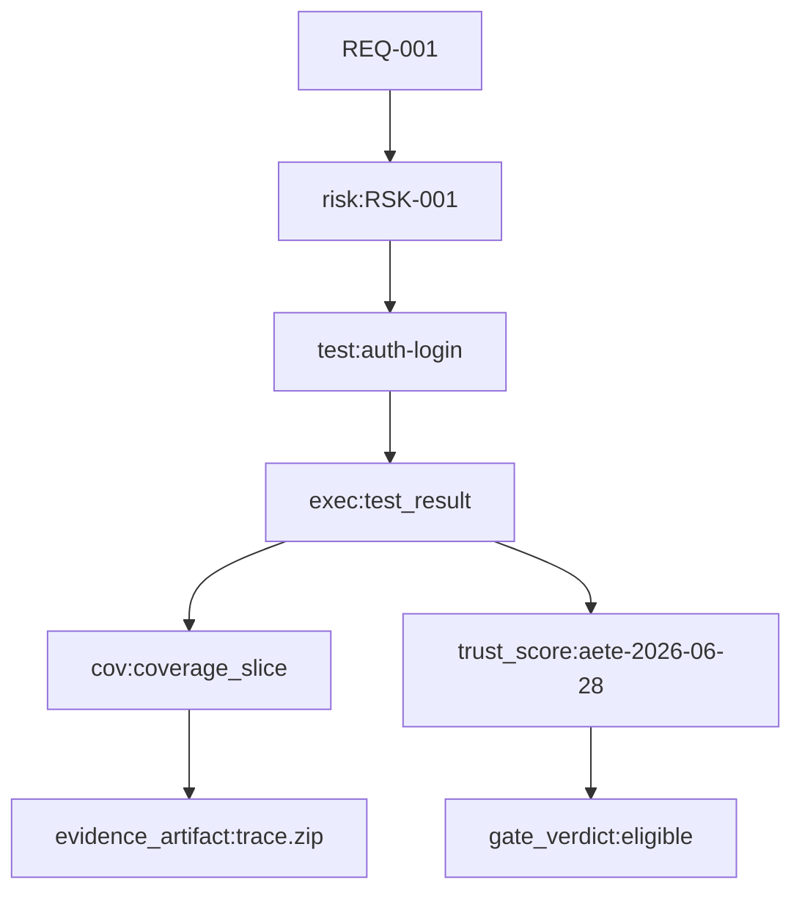
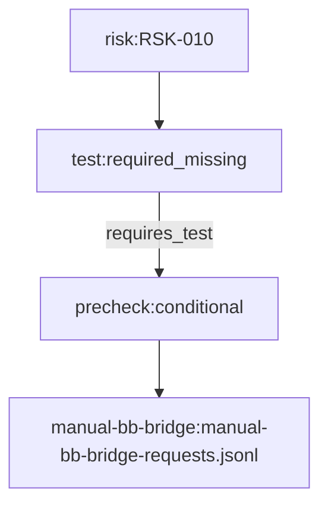

# HATE 仕様書：SHIPYARD 追加ドラフト

`SPECIFICATION.md` の拡張用ドラフト。既存仕様の骨格は維持し、QEG / workflow-cookbook 様式の
受入性、証跡トレーサビリティ、shipyard-cp 接続を実装しやすい粒度で埋めることを目的とする。

## 20. 要件定義→仕様トレーサビリティ行列

| 要件定義ID | 要件定義ソース | 仕様反映先(追加候補) | 受入トレース |
|---|---|---|---|
| REQ-INT-001 | README / BLUEPRINT 役割定義 | `2. 正本関係`, `5. システム文脈`, `15. CLI Contract`, `13. QEG Export Contract` | P0 以降の EVALUATION と整合 |
| REQ-INT-002 | BLUEPRINT Scope In/Out | `4. Scope`, `6. 機能要件` の P0a/P0b/P1a/P1b/P2/P3 粒度 | Scope 差分チェック、Task Seed と acceptance の逆引き |
| REQ-INT-003 | BLUEPRINT QEG責務境界 | `6. 機能要件`, `16. Phase Contract`, `23 QEG Node / Edge Mapping 詳細` | HATE が再実装しない項目の監査項目として列挙 |
| REQ-INT-004 | BLUEPRINT RanD/shipyard 連携前提 | `26. 実装順序と Shipyard-cp 接続案` | 任意入力での成功条件、上書き禁止の検証 |
| REQ-INT-005 | BLUEPRINT workflow-cookbook 連携前提 | `14. Workflow-cookbook Contract`, `24. workflow-cookbook 接続詳細` | Task Seed/Acceptance/Evidence/Birdseye の参照連鎖 |
| REQ-DOC-001 | P0A_GOLDEN_PATH | `21. P0a/P0b/P1a/P1b/P2/P3 Acceptance Matrix`, `22 Artifact / Schema / Fixture 詳細契約` | Golden input/expected 差分での再現可能性 |
| REQ-SCH-001 | SCHEMA_REGISTRY_CONTRACT | `8. Common Envelope`, `22 Artifact / Schema / Fixture 詳細契約` | record_type ごとの schema/unknown policy |
| REQ-GRD-001 | GUARDRAILS | `24. workflow-cookbook 接続詳細`, `11 DQ Contract`, `17 Acceptance` | 再実装禁止項目の検証 |
| REQ-WF-001 | WORKFLOW_COOKBOOK_INTEGRATION | `24. workflow-cookbook 接続詳細`, `25. DQ / soft_gap / risk debt / manual-bb bridge` | acceptance_refs / evidence refs / stale / birdseye |
| REQ-EVAL-001 | EVALUATION | `21 Acceptance Matrix`, `26 実装順序と Shipyard-cp 接続案` | P0〜P3 の受入完了条件 |

### 20.1 要件→Acceptance 逆引きルール

- 全要件は最低 1 つの受入観点に接続され、`EVALUATION.md` の「受入条件」を起点に 1:多で参照。
- 要件→TASK→acceptance の順に追えることを最優先にし、同一要求を複数セクションで重複説明しない。
- 仕様更新は `README / BLUEPRINT / GUARDRAILS / EVALUATION / RUNBOOK` との差分一致でロールフォワード。

## 21. P0a/P0b/P1a/P1b/P2/P3 Acceptance Matrix（追加）

### 21.1 P0a（local-first 最短成立）

| AC-P0a-ID | 受入条件 | 仕様化ポイント | 判定データ |
|---|---|---|---|
| AC-P0a-01 | GitHub provenance + JUnit + LCOV で precheck 判定 | `6. 機能要件`, `13. QEG Export` の P0a 前提 | `HATE-run.json`, `HATE-test-results.ndjson`, `HATE-coverage.ndjson`, `artifact-manifest.json`, `precheck-decision.json`, `record.json`, `summary.md` |
| AC-P0a-02 | `precheck-decision.decision` が `eligible|conditional|ineligible|hard_dq` の4値のみ | `10. Precheck Decision Contract` | `precheck-decision.json` |
| AC-P0a-03 | `gate-decision.json` は互換 alias、release正本にはしない | `10. Precheck Decision Contract` | 参照関係と文書明示 |
| AC-P0a-04 | artifact が無くても artifact-manifest が生成される | `9. Artifact Manifest Contract` | `artifact-manifest.json` |
| AC-P0a-05 | P0a DQ（001/002/003/008/015）を再現できる | `11. DQ Contract` | DQ fixture |
| AC-P0a-06 | external 依存なしで 5 分以内に決定できる | `HATE-NFR-001` / `P0A` quickstart | 実行時間ログ |

### 21.2 P0b（QEG 連携成立）

| AC-P0b-ID | 受入条件 | 仕様化ポイント | 判定データ |
|---|---|---|---|
| AC-P0b-01 | SARIF / Playwright / diff-risk-test を sourceRefs 化 | `6. 機能要件`, `13. QEG Export Contract` | `HATE-static.sarif`, `HATE-coverage.ndjson`, `evidence-map.json`, `artifact-manifest.json` |
| AC-P0b-02 | `qeg-bundle.json` が minimal valid fixture と互換 | `13. QEG Export Contract`, `22. Artifact / Schema / Fixture 詳細契約` | `qeg-bundle.json`, `schema-registry.json` |
| AC-P0b-03 | evidence-map が `requires_test/evidenced_by` を持つ | `23.3 Mapping 例`, `23.2 エッジ種類（必須/推奨）` | `evidence-map.json` |

### 21.3 P1a（trust hardening）

| AC-P1a-ID | 受入条件 | 仕様化ポイント | 判定データ |
|---|---|---|---|
| AC-P1a-01 | AETE 8 次元、0/1/3/5、calibration metadata 必須 | `12. AETE Contract` | `aete-score.json`, `schema-registry.json` |
| AC-P1a-02 | canonical_test_id 系の安定化 | `6 FR-012`, `11 DQ Contract` | `HATE-test-results.ndjson` |
| AC-P1a-03 | matrix/shard/retry の決定的集約 | `HATE-FR-011` | `HATE-test-results.ndjson` |
| AC-P1a-04 | path normalization が sourceRefs の参照ずれを起こさない | `HATE-NFR-006` | `artifact-resolver-map.json`, QEG sourceRefs |
| AC-P1a-05 | schema registry と conformance 併走 | `22. Artifact / Schema / Fixture 詳細契約` | `schema-registry.json`, `SCHEMA_REGISTRY_CONTRACT.md` |
| AC-P1a-06 | replay / compare / explain / recommend / doctor を前提入力で再現 | `6 FR-013`, `15 CLI Contract` | 対応 CLI fixture |
| AC-P1a-07 | risk debt が owner/age/recommended_actions を持つ | `11 DQ Contract`, `25. DQ / soft_gap / risk debt / manual-bb bridge` | `risk-debt-register.json` |

### 21.4 P1b（外部運用接続）

| AC-P1b-ID | 受入条件 | 仕様化ポイント | 判定データ |
|---|---|---|---|
| AC-P1b-01 | RanD audit packet を上書きせず alignment を生成 | `25. DQ / soft_gap / risk debt / manual-bb bridge` | `requirement-evidence-alignment.json` |
| AC-P1b-02 | high-risk gap から manual-bb bridge を起票 | `25. DQ / soft_gap / risk debt / manual-bb bridge` | `manual-bb-bridge-requests.jsonl`, `workflow-evidence.jsonl` |
| AC-P1b-03 | shipyard run/audit 参照の添付に成功 | `26. 実装順序と Shipyard-cp 接続案` | `shipyard-run-evidence.json` |
| AC-P1b-04 | Task Seed / Acceptance / Evidence / Docs stale / Birdseye の参照連鎖が取れる | `24. workflow-cookbook 接続詳細`, `25. Workflow 証跡の整合性ルール` | 5種 workflow artifact |
| AC-P1b-05 | workflow checker/plugin host を再実装しない | `24. workflow-cookbook 接続詳細` + GUARDRAILS | 受入証跡 |

### 21.5 P2（productization 追加層）

| AC-P2-ID | 受入条件 | 仕様化ポイント | 判定データ |
|---|---|---|---|
| AC-P2-01 | PR annotation / artifact budget / attestation を optional として扱う | `WORKFLOW / GUARDRAILS / P2` | `adoption*`, `incident*`, `residency*` 系 |
| AC-P2-02 | hosted/read model API への再構築可能性を維持 | `22. Artifact / Schema / Fixture 詳細契約`, `WORKFLOW` | bundle -> read model mapping |
| AC-P2-03 | compliance/security/telemetry docs の制約が precheck を阻害しない | `25. DQ / soft_gap / risk debt / manual-bb bridge`, `20. 要件定義→仕様トレーサビリティ行列` | 対応 artifact |

### 21.6 P3（Enterprise readiness）

| AC-P3-ID | 受入条件 | 仕様化ポイント | 判定データ |
|---|---|---|---|
| AC-P3-01 | PRG-0..PRG-6 が artifact/metric で表現される | `21. Acceptance Matrix`, `22. Artifact / Schema / Fixture 詳細契約`, `product-readiness-report` | `product-readiness-report.json` |
| AC-P3-02 | legal/roadmap/security/assurance の未解決が evidence 決定を変えない | `GUARDRAILS`, `WORKFLOW` | 対応 artifact |
| AC-P3-03 | retention/legal hold/export/deletion 要件が artifact classification に追随 | `25. DQ / soft_gap / risk debt / manual-bb bridge`, `22. Artifact / Schema / Fixture 詳細契約` | `privacy-report`, `audit-fixture-manifest` |

## 22. Artifact / Schema / Fixture 詳細契約

### 22.1 Artifact 一覧（追加優先度付き）

| Artifact | 用途 | 必須相当 | フェーズ | 主な schema |
|---|---|---|---|---|
| `HATE-run.json` | run メタデータと provenance | yes | P0a | `schemas/HATE/v1/run.schema.json` |
| `HATE-test-results.ndjson` | test_result の行単位 evidence | yes | P0a | `schemas/HATE/v1/test-result.schema.json` |
| `HATE-coverage.ndjson` | coverage_slice の行単位 evidence | yes | P0a | `schemas/HATE/v1/coverage-slice.schema.json` |
| `artifact-manifest.json` | artifact catalog と safety state | yes | P0a | `schemas/HATE/v1/artifact-manifest.schema.json` |
| `precheck-decision.json` | HATE evidence eligibility | yes | P0a | `schemas/HATE/v1/precheck-decision.schema.json` |
| `record.json` | own-output validation record | yes | P0a | `schemas/HATE/v1/audit-record.schema.json` |
| `qeg-bundle.json` | QEG import 用 | P0b | P0b | `schemas/HATE/v1/qeg-bundle.schema.json` |
| `diff-risk-test.json` | code-to-gate リスクと検証設計の接続 | yes | P0b | `schemas/HATE/v1/evidence-ref.schema.json` |
| `evidence-map.json` | risk↔test↔evidence の中間 graph | P0b | P0b | `schemas/HATE/v1/graph.schema.json` |
| `aete-score.json` | score + confidence + calibration | yes | P1a | `schemas/HATE/v1/aete-score.schema.json` |
| `artifact-resolver-map.json` | path/url 解決結果 | optional | P1a | `schemas/HATE/v1/artifact-resolution.schema.json` |
| `doctor-report.json` | 事前診断 | optional | P1a | `schemas/HATE/v1/doctor.schema.json` |
| `schema-registry.json` | record/schema 互換管理 | P1a | P1a | `schemas/HATE/v1/schema-registry.schema.json` |
| `requirement-evidence-alignment.json` | RanD との要件結線 | P1b | P1b | `schemas/HATE/v1/requirement-alignment.schema.json` |
| `shipyard-run-evidence.json` | shipyard への evidence 添付 | P1b | P1b | `schemas/HATE/v1/shipyard-run-evidence.schema.json` |
| `workflow-task-seed.json` | Task Seed mapping | P1b | P1b | `schemas/workflow/task-seed.schema.json` |
| `workflow-acceptance-record.json` | Acceptance mapping | P1b | P1b | `schemas/workflow/acceptance-record.schema.json` |
| `workflow-evidence.jsonl` | Evidence 連携 | P1b | P1b | `schemas/workflow/workflow-evidence.schema.jsonl` |
| `workflow-docs-stale.json` | docs/schemas/fixtures stale | P1b | P1b | `schemas/workflow/docs-stale.schema.json` |
| `workflow-birdseye-map.json` | Docs/adapter/schema/fixture 依存候補 | P1b | P1b | `schemas/workflow/birdseye.schema.json` |
| `risk-debt-register.json` | soft gap / manual 補完追跡 | P1a+ | P1a | `schemas/HATE/v1/risk-debt.schema.json` |
| `manual-bb-bridge-requests.jsonl` | 手動補完要求起票 | P1b | P1b | `schemas/HATE/v1/manual-bb-bridge.schema.jsonl` |

### 22.2 Record Envelope 詳細

既存の共通 envelope は維持し、`record_id` は `artifact-role` と `run_id` を含む構文に揃える。例:

```text
{schema}_{run_id}_{run_attempt}_{artifact_type}_{seq}
```

必須 fields への要件:

- `schema_version` は `HATE/v1`
- `record_type` は `SCHEMA_REGISTRY_CONTRACT` の policy と一致
- `sha256` は record または主要 payload の digest。算出不能時は `""` + `redaction_status=pending` として失敗理由を `redaction_error` に記録
- `payload` 内に `traceability` を持たせ、`source_refs` の空配列禁止（最低1件）

### 22.3 Fixture 契約

### 22.3.1 P0a golden fixture

`fixtures/golden/p0a-minimal` は以下を必須化する:

- `input/` と `expected/` のペアが 1:1
- `expected/` 差分は `git diff --check` 非依存で deterministic
- DQ fixture (`dq-01`, `dq-02`, `dq-03`, `dq-08`, `dq-15`) を必ず含む
- expected に `summary.md`（public-safe）を必須収録

### 22.3.2 P0b / P1 契約テスト

- `fixtures/workflow/*` は workflow 接続 1:1 サンプルを保証
- `fixtures/qeg/minimal/*` は `qeg-bundle.json` の schema 版 1 系統を対象
- `fixtures/schema-registry/*` は `valid-minimal`, `valid-full`, `invalid-additional-property` を保持

## 23. QEG Node / Edge Mapping 詳細（追加）

### 23.1 ノード種類

| HATE ソース | QEG node kind | 必須項目 | 任意項目 |
|---|---|---|---|
| requirement / acceptance | `requirement`, `acceptance_criterion` | `id`, `title`, `sourceRefs`, `owner`, `created_at` | `scope`, `persona`, `kpi` |
| changed file | `changed_code` | `path`, `range`, `sourceRefs` | `diff_hunk`, `risk_score` |
| finding / risk | `risk`, `finding` | `risk_id`, `severity`, `sourceRefs`, `description` | `status`, `evidence_hint` |
| canonical test case | `test`, `test_case` | `canonical_test_id`, `identity_components` | `labels`, `framework` |
| 実行結果 | `execution_evidence` | `result`, `canonical_test_id`, `artifact_refs` | `retry_index`, `flaky_state` |
| coverage スライス | `coverage` | `coverage_file`, `path`, `changed_file_refs` | `contexts`, `branch_count` |
| artifact | `evidence_artifact` | `artifact_id`, `kind`, `path`, `sha256` | `retention`, `redaction_status` |
| AETE 判定 | `trust_score` | `rubric_version`, `score`, `calibration_status` | `dimension_scores` |
| precheck | `gate_verdict` | `decision`, `dq_summary`, `evidence_refs` | `risk_debt_refs` |

### 23.2 エッジ種類（必須/推奨）

| Edge kind | 由来 | 意味 | 必須属性 |
|---|---|---|---|
| `derives_from` | RanD / requirements | 要件 → 受入準拠 | `from`, `to`, `sourceRefs` |
| `touches` | `code-to-gate` | 変更コード → リスク | `changed_range` |
| `requires_test` | risk engine | リスク → 必要 test case | `required_dimensions` |
| `evidenced_by` | test execution | 具体 test → evidence | `weight`, `artifact_refs` |
| `supports` | execution/coverage/sarif | evidence → requirement / risk / finding | `confidence` |
| `contradicts` | SARIF findings | evidence が claim と矛盾 | `severity`, `blocking` |
| `decides` | precheck | precheck → QEG export | `decision`, `dq_breakdown` |
| `maps_to` | schema / profile | adapter capability → missing dimension | `dimension`, `missing_reason` |

### 23.3 Mapping 例

#### 例1: 高リスク変更に対する実行証跡あり



対応 JSON イメージ（概念）:

```json
{
  "nodes": [
    {"id":"node--test--auth-login", "kind":"test", "traceability":{"sourceRefs":["HATE-test-results.ndjson#TR-..."],"canonical_test_id":"playwright:tests/auth/login.spec.ts::login works"}},
    {"id":"node--evidence_artifact--trace-1", "kind":"evidence_artifact", "traceability":{"sha256":"...","sourceRefs":["artifact-manifest.json#art-1"]}}
  ],
  "edges": [
    {"id":"e1","kind":"evidenced_by","from":"node--test--auth-login","to":"node--evidence_artifact--trace-1","traceability":{"sourceRefs":["artifact-manifest.json"]}}
  ]
}
```

#### 例2: high-risk changed path が未実行（soft_gap）



- edge `supports` は存在しない。代わりに `requirement` には `risk_debt_refs` を付与し、manual 補完要求へ橋渡し。

## 24. workflow-cookbook 接続詳細

### 24.1 目的

HATE は workflow-cookbook の checker / plugin host / Birdseye generator を実装せず、
以下 5 つの接続素材を生成する。

- Task seed 相当 (`workflow-task-seed.json`)
- acceptance record 相当 (`workflow-acceptance-record.json`)
- Evidence 相当 (`workflow-evidence.jsonl`)
- docs stale (`workflow-docs-stale.json`)
- birdseye map (`workflow-birdseye-map.json`)

### 24.2 P0a〜P1b での接続粒度

| 接続対象 | 入力 | 変換規則 | 出力 |
|---|---|---|---|
| Task Seed | `TASK.codex.md` 内の HATE-MVP-* | 1件を0.5日規模に分割せず、task_id を維持 | `workflow-task-seed.json` |
| Acceptance | `EVALUATION.md` 条件群 + 実行結果 | acceptance item の参照を acceptance_id に集約 | `workflow-acceptance-record.json` |
| Evidence | run/qeg/aete/dq artifact refs | 証跡 record を `artifact_refs` 配列へ吸収 | `workflow-evidence.jsonl` |
| Docs stale | docs/schema/fixture の最終確認日 | 期限超過・missing-reference・未検証で required_action | `workflow-docs-stale.json` |
| Birdseye map | docs, schema, fixtures の参照関係 | 参照ノードを `node_id` 化して deps を保持 | `workflow-birdseye-map.json` |

### 24.3 Workflow CLI 相当契約（追加）

- `HATE workflow task-seed`：HATE-MVP-* を `workflow-task-seed.json` へ変換
- `HATE workflow acceptance --task <task_id>`：該当 acceptance を `workflow-acceptance-record.json` へ変換
- `HATE workflow evidence --run <run_id>`：NDJSON 化した evidence 行を `workflow-evidence.jsonl` へ変換
- `HATE workflow docs-stale --scope repo`：docs stale map 生成
- `HATE workflow birdseye --scope evidence`：依存候補の図化素材

### 24.4 Workflow 証跡の整合性ルール

- `workflow-task-seed.task_id` と TASK の `task_id` は同一文字列を使う。
- `workflow-acceptance.task_id` と P1b acceptance の `task_id` は 1 対 1。
- `workflow-evidence.record_id` は `run_id` + `sequence`。
- すべての `artifact_refs` が `HATE-*.json`/`*.ndjson` か既存 `qeg-bundle.json` へ紐づくことを前提検証。
- Birdseye は render 正本ではなく候補マップとして扱い、レイアウト計算は recipe host 側に委譲。

## 25. DQ / soft_gap / risk debt / manual-bb bridge

### 25.1 DQ と soft_gap の分類

- `hard_dq`: precheck を停止し、`qeg-bundle.json` は `debug_only` 扱い
- `soft_gap`: export は許容するが、`precheck-decision=conditional` とし、`risk_debt_register`/`manual-bb` を生成
- DQ は adapter / profile 固定。実行時フラグで mutable しない。

### 25.2 soft_gap 主要条件（例）

- high-risk changed path への execution evidence 0 件
- required assertion/context 欠損（mutation/pact/contract 等）
- AETE score confidence が低いが必須判定に足りない場合
- artifact safety の redaction pending + optional で必要証跡

### 25.3 risk debt register スキーマ（最小）

```yaml
risk_debt_id: string
status: open | investigating | in_progress | closed
debt_type: soft_gap | conditional_candidate | missing_evidence | profile_mismatch
severity: low | medium | high | critical
owner: string
age_days: number
source_refs: array
recommended_actions: array[object]
evidence_refs: array
next_action_at: timestamp
```

### 25.4 manual-bb bridge

- 条件:
  - `risk_debt.status=open`
  - `severity` が高〜critical
  - `evidence_refs` の不足が manual 補完で解消可能
- 出力:
  - `manual-bb-bridge-requests.jsonl`（1件1 gap）
  - `requirement-evidence-alignment.json` の `manual_actions` に `manual-bb-bridge-request-id` を付与
- 禁止:
  - manual-bb を「go」として見なすこと
  - RanD の `no_go` / `conditional_go` を上書きすること

## 26. 実装順序と Shipyard-cp 接続案

### 26.1 実装順序（実装チーム向け）

1. **Phase A（P0a）**: envelope / provenance / junit / lcov / manifest / precheck / record / golden
2. **Phase B（P0b）**: SARIF + Playwright artifact + diff-risk-test + qeg bundle
3. **Phase C（P1a）**: DQ hard/soft 境界安定化、AETE, canonical identity, resolver, registry
4. **Phase D（P1b）**: RanD alignment / shipyard / workflow-cookbook / manual-bb bridge
5. **Phase E（P2）**: PR annotation / artifact budget / attestation / read model / enterprise拡張

### 26.2 Shipyard-cp RunSystemPacket / WorkerResult Mapping

#### RunSystemPacket として取り込む想定キー

- `run_id`, `run_attempt`, `task_id`, `repo`, `commit_sha`
- `state`, `created_at`, `updated_at`, `started_at`, `completed_at`
- `audit_refs`（run/event trace）
- `worker_assignments`（任意）

#### WorkerResult として取り込む想定キー

- `worker_id`, `status`, `summary`, `error`, `artifacts`, `attempt`, `retry_count`
- `timings`, `exit_code`, `environment`

#### shipyard-run-evidence.json 変換先フィールド

| shipyard 入力 | shipyard-run-evidence 受け皿 | 変換内容 |
|---|---|---|
| run_id / run_attempt | `run_meta.run_id` / `run_meta.run_attempt` | 文字列/数値維持 |
| task_id | `run_meta.task_id` | 文字列をそのまま |
| commit_sha | `run_meta.commit_sha` | 変更なし |
| artifacts | `evidence_bundle.artifact_refs` | `artifact-manifest` と整合 |
| summary | `evidence_bundle.hate_summary` | summary の safe-only section |
| dq / aete | `risk_and_trust` | hard/soft DQ、AETE score |
| audit_refs | `source_refs` | 再追跡可能な id 列 |
| worker_status | `publish_gate_hint` | publish 条件は判断せず、状態要約のみ |

### 26.3 Shipyard 連携ルール（重要）

- HATE は **shipyard の state machine / publish approval / worker dispatch を再実装しない**
- shipyard-run-evidence は advisory（補助情報）であり、最終的な判定は shipyard 側で実施
- `run_state=failed` でも artifact refs と DQ summary を必ず添付し、再現性のある監査ログを残す
- `audit` 側の evidence refs は `workflow-evidence.jsonl` と同一 ID 契約で整合

## 27. 統合時の見出し追加提案

上記を `SPECIFICATION.md` に統合する際は、既存 1〜19 の後段として次を追加する想定。

- 20. 要件定義→仕様トレーサビリティ行列
- 20.1 要件→Acceptance 逆引きルール
- 21. P0a/P0b/P1a/P1b/P2/P3 Acceptance Matrix
- 22. Artifact / Schema / Fixture 詳細契約
- 23. QEG Node / Edge Mapping 詳細（追加）
- 24. workflow-cookbook 接続詳細
- 25. DQ / soft_gap / risk debt / manual-bb bridge
- 26. 実装順序と Shipyard-cp 接続案
