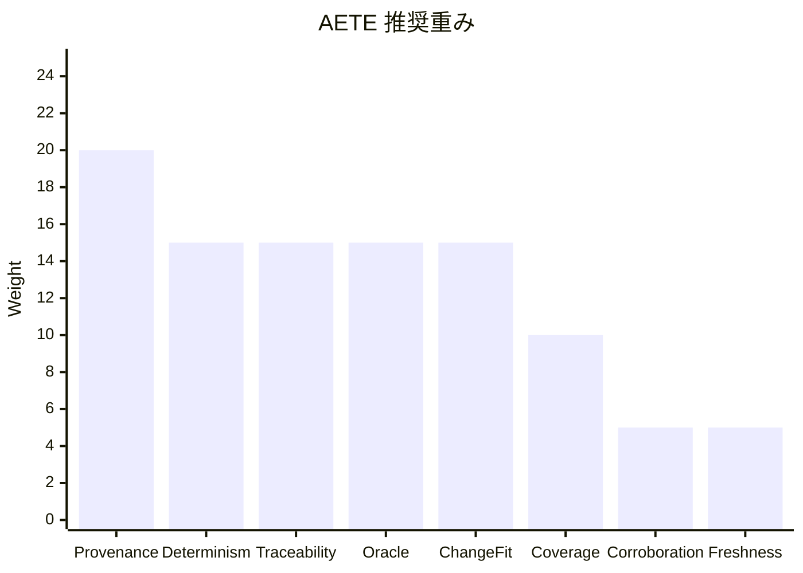
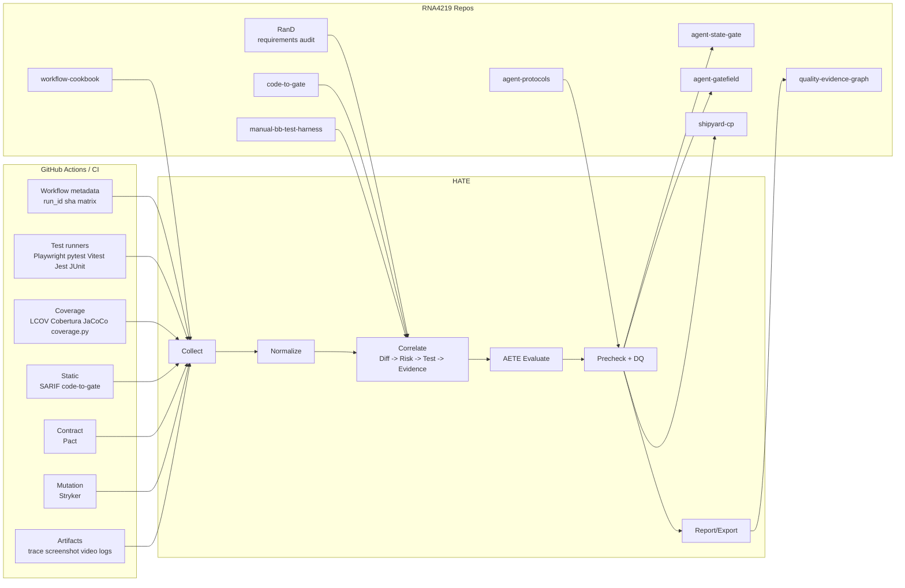
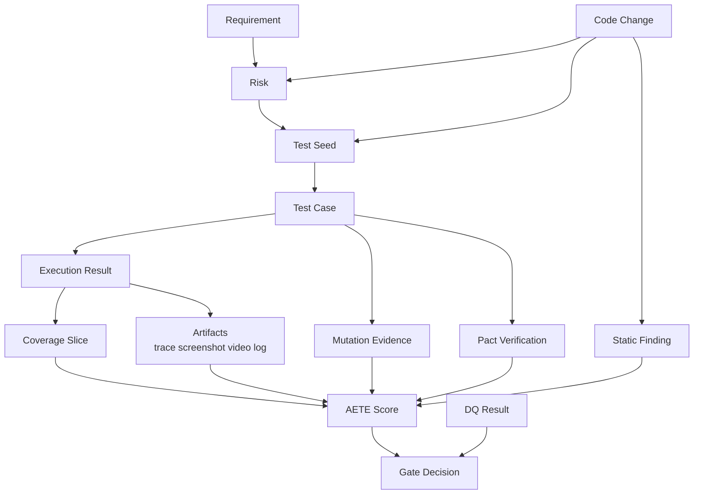

# harness-auto-test-evidence 改訂要件仕様調査報告

## エグゼクティブサマリー

`harness-auto-test-evidence` を、単なる「テスト結果の収集器」ではなく、自動テスト証跡の信頼性を評価し、その評価結果を Quality Evidence Graph に接続できる optional evidence へ整形するハーネスとして再定義するのが最も妥当です。既存の RNA4219 リポジトリ群はすでに、手動観点生成 (`manual-bb-test-harness`)、差分とリスクの抽出 (`code-to-gate`)、証跡グラフと DQ 優先ガバナンス (`quality-evidence-graph`)、Evidence 契約 (`agent-protocols`)、実行統制 (`shipyard-cp` / `agent-state-gate` / `agent-gatefield`) という骨格を持っています。HATE の役割は、この骨格に対して 自動テスト固有の証跡収集・正規化・評価・可視化・外部エコシステム接続を埋めることです。

設計上の最大の論点は、「カバレッジを証跡として扱う」だけでは足りず、そのカバレッジとテスト自体の信用を評価しなければならないことです。これは研究的にも支持されます。コードカバレッジは未テスト領域の発見には有効ですが、テスト有効性の代理指標としては強くなく、変異テストやフレーク制御、要件トレーサビリティ、変更差分への関連性の方が信頼性判断には重要です。したがって HATE では、Coverage を一指標に留め、AETE: Auto-Test Evidence Trust Evaluation を中核に置くべきです。

MVP は広げすぎない方がよく、優先度は GitHub Actions provenance + JUnit 系 test results + coverage (LCOV/Cobertura/JaCoCo) + SARIF + Playwright trace/screenshot/video + QEG export です。これだけで多言語・多レイヤーの証跡をかなりの程度統合できます。Pact、Stryker、Allure、OpenTelemetry、ReportPortal、Codecov、SonarQube はその上で段階的に入れるのが実装コストと価値のバランスがよいです。

最終的な推奨像は、HATE = CI 上の evidence collector / normalizer / correlator / evaluator / exporter、QEG = 判定グラフと DQ ガバナンスの実行系、code-to-gate = diff→risk→test-seed 抽出器、manual-bb-test-harness = 人間観点の上流生成器、agent-state-gate / gatefield = 人間レビューや publish を含む上位統制系、という責務分離です。これにより、ユーザーが言う「手動テストゼロ」の意味を、無統制の自動化ではなく、証跡付きで説明可能な自動品質保証として成立させられます。

## 追加検討: 懸念事項と拡張候補

改訂要件は方向性として妥当ですが、実装に入る前にいくつかの懸念を明示しておくべきです。第一に、P0 の範囲がやや大きいため、GitHub Actions provenance、共通 record envelope、JUnit、LCOV、artifact manifest、gate-decision、record.json だけで local-first precheck を完了する P0a と、SARIF、Playwright artifact、diff-risk-test、QEG export を含める P0b に分割するのが安全です。これにより、最初の実装で adapter と export と可視化を同時に抱え込むリスクを避けられます。

第二に、AETE の 8 次元評価は adapter ごとに取得できる証跡粒度が異なります。たとえば JUnit XML は execution result には強い一方、flaky 履歴や coverage context は持たないことが多く、Playwright trace は artifact 証跡に強い一方で mutation adequacy は別系統です。そのため、adapter capability manifest を早期に導入し、各 adapter が `flaky`, `coverage_context`, `artifact_hash`, `lineage`, `redaction` などをどこまで提供できるかを明示すべきです。未対応能力は hidden gap にせず、summary と JSON に出す必要があります。

第三に、DQ と soft gap の境界は HATE 側の adapter / AETE profile で固定する必要があります。とくに `changed high-risk path に対応テストが 0`、`coverage だけあり execution result がない`、`browser / platform matrix が不足` といった条件は、開発中の default profile と release profile で扱いを変えたくなる領域です。`default`, `strict`, `release`, `experimental` のような profile を設け、HATE 内の AETE threshold、必須 artifact、manual 補完条件を再現可能に切り替える設計が望ましいです。ただし最終的な Gate policy、waiver、approval は QEG に委譲します。

第四に、Playwright trace、screenshot、video、log は情報漏えいリスクが高いため、artifact manifest には `sha256`, `redaction_status`, `retention`, `size_bytes`, `public_exposure` だけでなく、`classification`, `redaction_rule_version`, `safe_for_summary` を持たせるべきです。public summary には `safe_for_summary=false` の artifact path や secret/token 由来の値を出さない制約が必要です。

第五に、QEG export は抽象的な node/edge mapping だけでは互換性が崩れやすいです。HATE 側に `minimal valid bundle fixture` を置き、QEG 側でも validate できる最小 bundle を早期に固定すべきです。これにより、HATE の schema 変更が QEG の import contract を破壊していないことを fixture regression で確認できます。

第六に、flaky、stale、baseline 差分、AETE 推移は単発 run だけでは十分に扱えません。MVP では履歴ストアを本格実装しなくても、baseline / history index の最小設計を追加しておくと、将来の flaky 判定や DQ 再発分析を自然に拡張できます。

追加機能としては、`HATE explain` と gap recommendation が有用です。`HATE explain --risk RISK-001` のように、特定 risk や test case が HATE precheck / AETE / QEG export 上でなぜ採用、除外、soft gap、hard DQ 相当になったかを辿れると、summary だけでは分からない証跡の説明責任を満たせます。また high-risk path に証跡が不足した場合、追加すべき test layer、manual 補完要否、Pact / mutation / Playwright などの推奨証跡を出せると、HATE は単なる判定器ではなく改善ループの起点になります。

さらに、実装準備段階で拡張候補を backlog として明示しておくと、P0 の local-first precheck を小さく保ちながら P1/P2 の伸びしろを失わずに済みます。優先したい候補は次の通りです。

| 拡張候補 | 優先度 | 追加価値 |
|---|---|---|
| `HATE replay` | P1a | frozen bundle から AETE / DQ / QEG export を再計算し、監査・回帰確認・スコア変更の影響確認に使う |
| `HATE compare` | P1a | base/head や前回 run との差分で trust delta、DQ 増減、risk coverage 低下を出す |
| `HATE explain --why-excluded / --why-score-changed` | P1a | 採用、除外、soft gap、hard DQ、スコア変動の根拠を risk/test/evidence 単位で説明する |
| `HATE recommend` | P1a | 不足 evidence から追加すべき test layer、Pact、mutation、Playwright、manual 補完を提案する |
| `HATE doctor` | P1a | adapter / schema / path / provenance / QEG fixture の事前診断を行い、実装・運用時の詰まりを早期に見つける |
| artifact resolver | P1a | local path、CI artifact URL、Windows path、container path、workspace 相対 path を一貫して解決し、summary と QEG export の参照ずれを防ぐ |
| schema registry | P1a | `HATE/v1` JSON Schema、互換性テスト、deprecated field 方針を管理し、QEG export 前の schema drift を検出する |
| adapter conformance fixtures | P1a | JUnit / LCOV / SARIF / Playwright などの正常・破損・欠損・retry/matrix 混在 fixture を揃え、adapter の最低準拠を検証する |
| adapter registry | P1a | adapter capability、必須/任意 artifact、既知制限、fixture、profile 対応を一覧化する |
| profile inheritance | P1a | `default -> strict -> release` の継承と差分表示により profile drift を防ぐ |
| manual-bb bridge | P1b | high-risk gap を `manual-bb-test-harness` 向け manual 補完要求として出力する |
| PR annotation export | P2 | GitHub Job Summary だけでなく changed high-risk path 単位の注釈を出す |
| artifact budget report | P2 | trace/video/coverage/SARIF の容量、保持期限、公開可否、上限超過を可視化する |
| signed evidence / attestation | P2 | provenance 署名や SLSA / in-toto 風 attestation へ接続し、証跡の改ざん耐性を上げる |
| canonical test identity | P1a | rename、parameterized test、matrix による履歴断絶を抑え、flaky / compare / baseline 判定の混線を防ぐ |
| AETE calibration metadata | P1a | `rubric_version`, `profile_version`, `score_confidence`, `calibration_status` を出し、未校正 score の過信を防ぐ |
| artifact threat model | P1a | secret scan、MIME / 拡張子整合、archive 展開制限、symlink / path traversal、外部 URL 参照の安全確認を定義する |
| precheck-decision naming | P0a | HATE precheck 出力を release Gate 正本と誤認しないよう、`gate-decision.json` を互換 alias に留める |
| P1a phase split | P1a | 診断基盤、再現性、説明と改善に分け、P1a の実装肥大化を防ぐ |
| P0a golden path | P0 | `fixtures/golden/p0a-minimal` を docs / schema / examples / tests の共通入力にし、Time to First Evidence を短縮する |
| product error taxonomy | P1 | user-facing failure に stable error code と remediation を付け、supportability を高める |
| risk debt register | P1 | soft gap / manual 補完要求 / conditional candidate を owner、age、sourceRefs 付きで追跡する |
| privacy report / quarantine | P1 | unsafe artifact を summary / QEG export / external export から隔離し、監査可能にする |
| packaging / entitlement | P2/P3 | edition、entitlement、usage meter、over-limit を明示し、契約状態が証跡判定を変えないようにする |
| customer-facing documentation | P2/P3 | quickstart、schema、security、migration、support などの required docs と freshness を検証可能にする |
| SLO / incident response | P2/P3 | hosted SLO、incident class、status communication、containment、postmortem を証跡に紐づける |
| customer success / adoption | P2/P3 | onboarding、success plan、adoption health、renewal readiness を artifact と metric で追跡する |
| security review / trust packet | P2/P3 | data flow、control mapping、SBOM、vulnerability、subprocessor を提出可能な証跡にする |
| privacy-safe telemetry / analytics | P2/P3 | opt-in telemetry と aggregate metrics で導入・性能・docs・support の改善を測る |
| data residency / deployment | P2/P3 | local、hosted、private tenant、customer managed、air-gapped の data flow と recovery を分ける |
| product governance / roadmap | P2/P3 | customer request、roadmap item、decision record、deprecation decision を追跡する |
| accessibility / localization | P2/P3 | dashboard、docs、CLI summary、support materials を利用可能にし、stable id を翻訳で変えない |
| legal / commercial contracting | P2/P3 | procurement response、commercial commitment、contract exception を source contract と照合する |
| audit fixture / assurance | P2/P3 | synthetic fixture、auditor walkthrough、evidence room、assurance summary で再計算性を示す |
| requirements portfolio | P1/P2 | tier、stage、WIP、dependency、P0 leak を管理し、要件の肥大化を制御する |
| enterprise product readiness gates | P2/P3 | PRG-0..PRG-6 により prototype から enterprise / regulated / product-ready までを artifact と metric で判定する |
| support diagnostic bundle | P2/P3 | secret / PII / unsafe artifact を含まない support 用 bundle を生成し、enterprise support に耐える |
| enterprise control plane | P3 | RBAC、audit log、retention、SSO / SCIM、SIEM / warehouse connector を canonical bundle から派生させる |

これらの拡張は、いずれも QEG の release Gate 正本を置き換えない前提で設計するべきです。`replay` と `compare` は HATE 内の再計算可能性を高め、`doctor`、artifact resolver、schema registry、adapter conformance fixtures は実装時の診断・互換性・参照解決の事故を減らします。`recommend` と `manual-bb bridge` は不足証跡を次アクションへ変換し、`adapter registry` と `profile inheritance` は adapter / profile の運用ミスを減らします。実装準備では schema drift を `SCHEMA_REGISTRY_CONTRACT.md`、adapter 拡張を `ADAPTER_SDK_CONTRACT.md`、不足証跡の継続追跡を `RISK_DEBT_REGISTER.md` に分離します。P2 の `PR annotation`, `artifact budget`, `attestation` はチーム運用や監査耐性を上げますが、P0/P1 の local-first precheck 成立を阻害しない optional enhancement として扱います。

Enterprise product-ready な水準へ進める場合は、技術要件に加えて、ICP、persona、edition、
supportability、security review、compliance pack、product readiness gate を
要件定義に含める必要があります。ただし hosted dashboard、SSO、RBAC、
enterprise connector は HATE の正本ではなく、canonical evidence bundle から派生する
product surface として扱うべきです。artifact privacy と quarantine は
`PRIVACY_QUARANTINE_CONTRACT.md`、hosted dashboard / API は `HOSTED_READ_MODEL_API.md`、
release / migration は `RELEASE_MIGRATION_POLICY.md`、packaging / entitlement は
`PACKAGING_ENTITLEMENT_CONTRACT.md`、customer-facing docs は
`CUSTOMER_DOCUMENTATION_CONTRACT.md`、SLO / incident response は
`SLO_INCIDENT_RESPONSE_CONTRACT.md`、導入成功は
`CUSTOMER_SUCCESS_ADOPTION_CONTRACT.md`、security review / trust packet は
`SECURITY_REVIEW_TRUST_CONTRACT.md`、product telemetry / analytics は
`PRODUCT_TELEMETRY_ANALYTICS_CONTRACT.md`、data residency / deployment は
`DATA_RESIDENCY_DEPLOYMENT_CONTRACT.md`、product governance / roadmap は
`PRODUCT_GOVERNANCE_ROADMAP_CONTRACT.md`、accessibility / localization は
`ACCESSIBILITY_LOCALIZATION_CONTRACT.md`、legal / commercial contracting は
`LEGAL_COMMERCIAL_CONTRACTING_CONTRACT.md`、audit fixture / assurance は
`AUDIT_FIXTURE_ASSURANCE_CONTRACT.md`、requirements portfolio は
`REQUIREMENTS_PORTFOLIO_OPERATING_MODEL.md` に分離します。local-first precheck と
QEG export が SaaS 機能に依存しないことが、監査・調達・再現性の面で最も重要です。

QEG を前提に置く場合、上記の懸念は再分類できます。`quality-evidence-graph` はすでに Gate policy、waiver、approval evidence、retention / immutability、source-backed Gate reason、DQ 優先、schema hardening、fixture regression、own-output validation を担うため、HATE がこれらを再実装する必要はありません。HATE の責務は、QEG の optional evidence producer / normalizer として、自動テスト固有の証跡を QEG が検証できる形へ加工することです。

したがって HATE 側に残すべき懸念は、`matrix / shard / retry` の決定的な集約、JUnit / coverage / SARIF / Playwright artifact の path normalization、adapter capability manifest、AETE の採点根拠出力、QEG fixture 互換、artifact safety の前処理です。一方で trust profile、release approval、waiver、retention、schema migration、source-backed Gate reason は QEG 側の統制に委譲し、HATE では QEG に渡す metadata と sourceRefs を欠かさないことに集中します。

この境界により、HATE の最終像は「自動テスト証跡の Gate 判定器」ではなく、「自動テスト証跡を QEG の判定材料へ変換する前段ハーネス」になります。HATE は AETE で証跡の自動テスト文脈上の信用を測り、QEG はその信用情報を含む証跡を release / Gate 統制として判定します。

客観性をさらに上げるには、RanD / KanoMode と shipyard-cp を外部観測点として接続するのが有効です。RanD は `requirements_packet.json` / `requirements_audit_packet.json` により、要求候補、KPI、受入条件、リスク、外部証跡、Requirement Definition Gate verdict を出せます。HATE はこの verdict を上書きせず、各 requirement / acceptance / risk に対して自動テスト証跡が存在するか、どの証跡が不足しているかを `requirement-evidence-alignment.json` として出すべきです。shipyard-cp は `plan -> dev -> acceptance -> integrate -> publish` の task / run / gate / audit モデルを持つため、HATE は Shipyard の state machine を再実装せず、`WorkerResult` / `RunSystemPacket` / audit refs に添付できる `shipyard-run-evidence.json` を生成するのがよいです。これにより AETE は「主観的なテスト信頼スコア」ではなく、「要件監査と運用 run に結び付いた再現可能な証跡評価」として扱えます。

実装運用の客観性には workflow-cookbook も接続できます。workflow-cookbook は Task Seed、Acceptance Record、Evidence、Birdseye / Codemap、workflow plugin を持つため、HATE は実装作業の進行、検収、証跡、文書鮮度、依存マップを `workflow-*` artifact として出すべきです。具体的には `workflow-task-seed.json`, `workflow-acceptance-record.json`, `workflow-evidence.jsonl`, `workflow-docs-stale.json`, `workflow-birdseye-map.json` を生成し、HATE の実装結果がどの Task Seed と acceptance record と evidence refs に支えられているかを追跡可能にします。ここでも HATE は workflow-cookbook の checker / plugin host / Birdseye 生成器を再実装せず、接続可能な素材を作る前段に徹します。

## 調査方法と設計前提

本調査では、RNA4219 の公開リポジトリ README / リポジトリページ、各 OSS の公式ドキュメント、ならびに原著論文または原著に近い一次資料を優先して参照しました。特に、Playwright、Vitest、pytest-cov / coverage.py、JaCoCo、Pact、Stryker、SARIF、Allure、ReportPortal、Codecov、SonarQube、OpenTelemetry、GitHub Actions の公式資料を設計根拠として採用しています。

RNA4219 側では、`manual-bb-test-harness` が「根拠付き観点→リスク→優先度→手動テストケース→工数→Gate 判定→Go/No-Go brief」という出力連鎖を明示し、`code-to-gate` が `findings.json`、`risk-register.yaml`、`test-seeds.json`、`release-readiness.json`、`results.sarif` を生成し、`quality-evidence-graph` が要求・差分・リスク・テストレイヤー・証跡アーティファクト・Gate を単一グラフ上で扱い、DQ を waiver では消せないという強い統制を持っています。`agent-protocols` は Evidence / Acceptance / PublishGate 契約を定義し、`workflow-cookbook` は Evidence tracking と release evidence を持ち、`shipyard-cp` は `plan -> dev -> acceptance -> integrate -> publish` を task/run/gate/audit モデルで統制します。

一方で、HATE に直接必要な「自動テスト証跡の正規化」「カバレッジとテストの信用評価」「diff→risk→test→evidence の可視化」は、既存群では一部が散在しているものの、専用フレームワークとしては未成立です。`portfolio` には `blueprint-to-playwright` と `ci-flaky-analyzer` があり、`test-portfolio-2026` は手動設計中心で Playwright は小規模サンプルに留まり、`Errorcook_Contextpatch` は CI failure を micro-test で再検証し、`agent-gatefield` / `agent-state-gate` は統制判定に強いものの、自動テスト証跡を多様な OSS から吸い上げて信用評価する層は未分離です。これが HATE の空席です。

なお、各 RNA4219 リポジトリの `docs/requirements.md` や `docs/spec/*` など深部文書は、今回の取得範囲では README から確認できた正本参照関係までは検証できましたが、全文の内容までは一律に確認できていません。そのため、README/公開ページで確認できた事項のみを確定情報とし、それ以上の詳細は unspecified と扱います。

## 調査結果と設計含意

### RNA4219 エコシステムから見た HATE の位置づけ

`manual-bb-test-harness` は、ブラックボックス観点から release gate までの人間系 QA 出力連鎖を定義しています。これは HATE にとって、自動テスト証跡が埋めるべき “人間観点の代替/補完対象” を明文化した上流仕様です。HATE はこの chain を横取りするのではなく、`root cause` が diff / risk / test coverage / oracle / flakiness のどこにあるかを、Evidence として自動で埋めるべきです。

`code-to-gate` は HATE の前段として極めて相性がよく、差分・構造・ルール・DB変更を解析して `findings`、`risk-register`、`test-seeds`、`release-readiness`、`SARIF` を吐き出します。これは HATE が「何を集めるか」を決めるための変更起点のスコーピング・ルータに使えます。すなわち HATE はテスト全件の羅列ではなく、`code-to-gate` が抽出した changed/risky paths を中心に evidence を結線することで、diff→risk→test の説明責任を持てます。

`quality-evidence-graph` は、HATE の最終出力先として最も自然です。QEG 側はすでに CLI contract (`validate`, `gate`, `record`) と exit code、DQ 優先、controlled governance、fixture regression、retention / immutability、waiver / approval 統制を持っているため、HATE 側で自動テスト証跡の正規化、AETE、artifact manifest、QEG 互換 export を整理し、QEG に「検証可能な optional evidence bundle」を渡す構造が実装上も運用上も安定します。HATE が直接 Go/No-Go を完結させるより、QEG と役割分担する方が再利用性が高いです。

`agent-protocols`、`workflow-cookbook`、`shipyard-cp`、`agent-state-gate`、`agent-gatefield` は、HATE が後段で publish / human review / Gate 記録に接続するための基盤です。とくに `agent-state-gate` が approval を `diff_hash` と `context_hash` に束縛して古い承認の再利用を防ぐ点は、HATE の provenance 設計でも後段互換の binding モデルとして参照すべきです。HATE が出す precheck / QEG export は、単発 JSON ではなく、後段で再演算・監査できる binding 付き packet である必要があります。

RanD は HATE の上流に「要件の客観性」を与える役割を持てます。KanoMode の audit mode は、既存要件を「書かれているから正しい」と扱わず、外部証跡、Kano 参照の仮分類、検収可能性、実装整合性から `go / conditional_go / no_go` を返します。HATE はその結果を自動テスト証跡で裏付ける側に回り、RanD の `no_go` や `conditional_go` issue を `coverage があるから go` のように上書きしないことが重要です。これにより、要求妥当性、検収可能性、実装証跡が分離され、レビュー時にどの層の問題かを説明できます。

### 公開 OSS と学術から見た設計含意

公式 OSS 群を見ると、テスト結果・カバレッジ・付随証跡・静的解析結果の標準的な搬送体はほぼ出揃っています。Playwright は trace viewer、screenshots、videos、attachments、JUnit-style XML reporter を提供し、pytest-cov / coverage.py は HTML/XML/JSON/Markdown/LCOV に加えて coverage context により「どのテストがどの行を通したか」を記録できます。JaCoCo は XML を公式出力し、SonarQube は coverage と execution を外部ツールから import する設計で、SARIF は静的解析結果の共通交換フォーマット、GitHub も SARIF 2.1.0 subset を受け付けます。つまり HATE が新たに発明すべきなのはフォーマットではなく、横断正規化と信頼評価です。

Pact、Stryker、Allure、ReportPortal、Codecov、OpenTelemetry は、HATE を「単なる集計」から「信頼可能な証跡オーケストレータ」へ引き上げる補助線です。Pact は `can-i-deploy` と verification result publication により、単体/結合テストでは見えないインタフェース整合性と deploy-safe 判定を与えます。Stryker は mutant states / metrics により、coverage の弱点を補う oracle strength / adequacy 指標を与えます。Allure と ReportPortal は attachment・timeline・history・dashboard を提供し、Codecov は PR diff coverage と flags、OpenTelemetry は logs/metrics/traces の相関と semantic conventions を提供します。HATE はこれらを「置き換える」のではなく、エビデンス正本を HATE/QEG に置いたうえで、見せ方や補助分析に外部ツールを使うのがよいです。

学術的には、HATE が coverage を“主役”にしてはいけない理由が明確です。Inozemtseva と Holmes は、テストスイートサイズを統制すると coverage と effectiveness の相関は低〜中程度であり、強い coverage criterion ほど有効性を保証するわけではないと報告しています。これに対し、Just らは mutant detection と real fault detection の有意な相関を示しており、mutation 系指標は coverage より adequacy 寄りの情報を持ちます。また、Luo らは flaky test が regression testing の信頼を損ない、主因に race condition、external dependency、statefulness が多いことを示しました。さらに、Cleland-Huang らの traceability 研究は、要求から下流成果物までのトレースが重要でありながら実務では ad-hoc になりやすいことを示しています。HATE のスコアリングは、この四点を直に反映すべきです。

### 候補 OSS アダプタ比較

次表は、HATE の一次対象として妥当なアダプタ候補を、正規化しやすさ・説明可能性・RNA4219 既存資産との接続性の観点で要約したものです。内容は各公式 docs と RNA4219 公開 README の要約です。

| カテゴリ | 候補 | 強み | 弱み | HATE 優先度 |
|---|---|---|---|---|
| テスト結果 | JUnit XML | 事実上の共通交換形式。CI 連携が広い | 単一の厳密な公式 universal schema が弱い | P0 |
| テスト結果 | Open Test Reporting | JUnit Platform の新しい event-based 形式 | エコシステム浸透はまだ限定的 | P1 |
| E2E 証跡 | Playwright trace/video/screenshot | 失敗時の再現性・可観測性が高い | ストレージが重い | P0 |
| カバレッジ | LCOV | JS/TS で普及、差分可視化に強い | per-test 文脈が弱い | P0 |
| カバレッジ | Cobertura XML | import 先が多い | DTD/互換差異に注意 | P0 |
| カバレッジ | JaCoCo XML | JVM 向けに安定、branch/function richness | JVM 中心 | P0 |
| カバレッジ | coverage.py contexts | test→line explainability が強い | Python 寄り | P0 |
| 静的解析 | SARIF | 標準交換形式、GitHub code scanning 直結 | tool ごとの差異吸収が必要 | P0 |
| 契約 | Pact + Broker | can-i-deploy で deploy safe 判定が可能 | 契約試験未導入組織では初期コスト | P1 |
| Adequacy | Stryker MTE | mutation score でテストの強さを見られる | 実行コスト高 | P1 |
| 可視化 | Allure | attachments / history / timeline が強い | 本体の verdict graph は持たない | P1 |
| 可視化 | ReportPortal | 履歴・分析・dashboard に強い | サーバ運用負荷 | P2 |
| PR 分析 | Codecov | diff / flags / PR comment が強い | 正本としては外部依存が強い | P2 |
| 品質ポータル | SonarQube | coverage/execution import と quality gate | テスト証跡そのものの正本ではない | P2 |
| 観測性 | OpenTelemetry | traces/logs/metrics 相関が可能 | test artifact 自体は別管理が要る | P1 |

別の観点として、可視化/エクスポート先は「どこを正本にするか」で明確に分けるべきです。HATE/QEG を正本にし、Allure/ReportPortal/Codecov/SonarQube は二次利用先に留める方が、一貫した DQ と AETE を維持できます。

| 出力先 | 向いている用途 | HATE との関係 |
|---|---|---|
| QEG | 判定正本、DQ、監査 | 正本 |
| GitHub Job Summary / Artifact | CI 即時可読性、配布 | 一次配布 |
| Allure | 人間が失敗経緯を追う | 二次可視化 |
| ReportPortal | 長期履歴・チーム分析 | 二次分析 |
| Codecov | PR coverage review | 二次通知 |
| SonarQube | 継続的コード品質統合 | 二次品質ポータル |
| OpenTelemetry backend | CI observability / troubleshooting | 実行観測 |

## 改訂要件仕様

### 製品定義

`harness-auto-test-evidence` は、CI 実行から得られる自動テスト関連シグナルを収集し、正規化し、diff/risk/test/evidence の因果関係に沿って相関し、AETE によって自動テスト文脈上の信頼評価を行い、QEG や外部可視化ツールへ輸出する local-first / CI-first の evidence harness と定義するのがよいです。QEG が既に要求・差分・リスク・証跡・Gate を結ぶ runtime である以上、HATE はそこで不足する「自動テスト証跡の接続装置」であるべきです。Gate policy、waiver、approval、retention、schema migration は QEG に委譲し、HATE は QEG が検証できる optional evidence を作る前段に集中します。

### 改訂機能要件

以下を改訂後 FR の推奨セットとします。ここでは “実装すべき最低粒度” まで落としています。

| ID | 機能要件 |
|---|---|
| FR-01 | GitHub Actions / CI 実行から provenance を収集する |
| FR-02 | JUnit XML / OTR / Playwright / pytest / Vitest / Jest / JUnit 実行結果を canonical test result に正規化する |
| FR-03 | LCOV / Cobertura XML / JaCoCo XML / coverage.py context を canonical coverage に正規化する |
| FR-04 | SARIF、Pact verification、Stryker mutation result を canonical evidence として取り込む |
| FR-05 | Playwright trace、screenshot、video、Allure attachment 等を artifact manifest で一元管理する |
| FR-06 | `code-to-gate` の findings / risk-register / test-seeds / release-readiness を入力に受ける |
| FR-07 | `manual-bb-test-harness` の観点/リスク/優先度モデルに対応できる test obligation モデルを持つ |
| FR-08 | diff→risk→test→evidence の相関グラフを構築する |
| FR-09 | AETE を evidence item、test case、suite、PR/change 単位で算出する |
| FR-10 | DQ ルールを評価し、失格証跡を HATE precheck / QEG export から除外または hard DQ として明示する |
| FR-11 | QEG へ node/edge bundle として export する |
| FR-12 | GitHub Job Summary、Markdown、HTML、JSON、SARIF、OTel event を出力する |
| FR-13 | Allure / ReportPortal / Codecov / SonarQube への export adapter を持つ |
| FR-14 | `record` 相当の監査可能な own-output validation record を生成する |
| FR-15 | `agent-protocols` Evidence / Acceptance / PublishGate 契約へ写像できる |
| FR-16 | RanD `requirements_packet.json` / `requirements_audit_packet.json` を入力し、requirement / KPI / acceptance / risk / gate_verdict と自動テスト evidence を結線する |
| FR-17 | shipyard-cp `WorkerResult` / `RunSystemPacket` / run-audit refs に HATE evidence bundle を添付できる形で出力する |
| FR-18 | workflow-cookbook の Task Seed / Acceptance / Evidence / docs stale / Birdseye へ接続できる `workflow-*` artifact を出力する |

これらは RNA4219 エコシステムの既存責務分離に素直に乗ります。`code-to-gate` が “何を試験すべきか” を、HATE が “何が実際に証明できたか” を、QEG が “その証明で通してよいか” を担当する構図です。

実装優先度は、FR 単位で次のように固定するのが安全です。P0a は local-first で precheck まで閉じる最小範囲、P0b は QEG 連携成立、P1a は証跡信頼度を上げる拡張、P1b は外部観測点との接続、P2 は外部運用・可視化との接続です。

| 優先度 | 対象 FR | 実装方針 |
|---|---|---|
| P0a | FR-01, FR-02, FR-03, FR-05, FR-10, FR-12, FR-14 | GitHub Actions provenance、共通 envelope、JUnit XML、LCOV、artifact manifest、minimal DQ/precheck、record を最小実装する |
| P0b | FR-05, FR-06, FR-08, FR-11, FR-12 | SARIF、Playwright artifact、diff-risk-test、evidence-map、QEG export、summary を追加し、QEG 連携を成立させる |
| P1a | FR-04, FR-07, FR-09, FR-15 | Pact / Stryker / coverage.py contexts / AETE / agent-protocols 写像を追加し、信頼評価と説明可能性を強化する |
| P1b | FR-16, FR-17, FR-18 | RanD 要件監査接続、shipyard-cp run/audit 接続、workflow-cookbook 実装運用接続を追加し、外部観測点との traceability を強化する |
| P2 | FR-13 | Allure / ReportPortal / Codecov / SonarQube export は non-gating optional adapter とし、外部サービス未導入でも precheck / QEG export を妨げない |

### 非機能要件

非機能面では、単なるレポート生成ツールではなく証跡系インフラとしての要件が必要です。

| ID | 非機能要件 |
|---|---|
| NR-01 | Local-first で、外部 SaaS がなくても評価完結できること |
| NR-02 | すべての normalized artifact に schema version を持たせること |
| NR-03 | commit SHA / run_id / attempt / timestamp / artifact hash を必須 provenance とすること |
| NR-04 | 同一入力に対する gate / score は決定的であること |
| NR-05 | アダプタ失敗と gate failure を exit code で分離すること |
| NR-06 | シークレットや機密パスは mask/redact policy を通すこと |
| NR-07 | 実行ログ・計測値は OpenTelemetry で外部 backend へ送れること |
| NR-08 | 大規模 mono-repo を想定し、changed-scope / flags / partial-run に対応すること |
| NR-09 | JSON / NDJSON を第一級とし、下流再計算を可能にすること |
| NR-10 | 人間向け summary は Markdown first、機械向けは canonical JSON first とすること |
| NR-11 | 外部 SaaS 連携は non-gating optional とし、未設定でも local-first の評価を完結できること |
| NR-12 | trace / screenshot / video / log は保持期間、サイズ上限、redaction 状態、公開可否を artifact manifest に記録すること |
| NR-13 | adapter ごとの capability manifest を持ち、対応できない証跡粒度を明示できること |

### 出力物要件

HATE の成果物は、後段で再利用しやすいように「正規化済みレコード」「相関結果」「評価結果」「可視化素材」に分けるべきです。

| 出力名 | 役割 |
|---|---|
| `HATE-run.json` | CI provenance / repo / sha / matrix / environment |
| `HATE-test-results.ndjson` | 正規化済み test result |
| `HATE-coverage.ndjson` | 正規化済み coverage slice |
| `HATE-static.sarif` | 正規化または集約済み static result |
| `HATE-contract.ndjson` | Pact verification / deploy-safety result |
| `HATE-mutation.ndjson` | mutation adequacy result |
| `artifact-manifest.json` | trace / screenshot / video / html / log の digest 管理 |
| `diff-risk-test.json` | diff→risk→test obligation / execution 対応表 |
| `risk-coverage-matrix.json` | リスク×テスト層×実行有無×AETE |
| `requirement-evidence-alignment.json` | RanD requirement / KPI / acceptance / risk / gate_verdict と HATE evidence の対応 |
| `evidence-map.json` | QEG export 前の graph bundle |
| `shipyard-run-evidence.json` | shipyard-cp WorkerResult / RunSystemPacket / audit refs へ添付する HATE evidence bundle |
| `workflow-task-seed.json` | HATE-MVP-* を workflow-cookbook Task Seed 互換へ写像 |
| `workflow-acceptance-record.json` | acceptance record へ転記できる検収結果 |
| `workflow-evidence.jsonl` | HATE artifact refs を Evidence 互換へ写像 |
| `workflow-docs-stale.json` | docs / schema / fixture の stale check 素材 |
| `workflow-birdseye-map.json` | HATE docs / adapters / schemas / fixtures の依存ノード候補 |
| `aete-score.json` | 各 evidence/test/suite/change の信頼スコア |
| `precheck-decision.json` | HATE precheck verdict / DQ / thresholds / reasons。release Gate 正本ではない |
| `gate-decision.json` | 既存互換 alias。新規実装では `precheck-decision.json` を優先 |
| `summary.md` | 人間向け run summary |
| `summary.html` | static HTML summary |
| `qeg-bundle.json` | QEG import 用 bundle |
| `otel-events.json` | OTel export するイベント / span 素材 |

### CLI 契約

QEG がすでに `validate / gate / record` を採用しているため、HATE もこれと揃えるのが運用上きれいです。

```text
HATE collect      # CI/runner outputs を収集
HATE normalize    # test/coverage/static/contract/mutation を canonical 化
HATE correlate    # diff→risk→test→evidence を結線
HATE evaluate     # AETE 計算
HATE precheck     # adapter/AETE profile + DQ による evidence eligibility 判定
HATE report       # md/html/job-summary 出力
HATE export       # qeg/allure/reportportal/codecov/sonarqube/otel
HATE record       # self-validation / audit record 出力
HATE doctor       # adapter / schema / path / provenance チェック
HATE align        # RanD requirements audit と自動テスト evidence の結線
HATE attach-run   # shipyard-cp run/audit refs 用 evidence bundle 生成
HATE workflow     # Task Seed / Acceptance / Evidence / docs stale / Birdseye 素材生成
HATE replay       # frozen bundle から AETE / DQ / QEG export を再計算
HATE compare      # base/head や前回 run との差分で trust delta / DQ 増減を出力
HATE explain      # risk/test/evidence の採用・除外・スコア変動理由を説明
HATE recommend    # 不足 evidence に対する追加 test layer / manual 補完候補を提案
```

推奨 exit code は以下です。QEG の release Gate とは分け、HATE precheck の
実行結果として扱います。

| exit code | 意味 |
|---|---|
| 0 | evidence eligible / conditional で出力生成成功 |
| 1 | CLI / schema / adapter failure |
| 2 | HATE precheck が evidence ineligible / hard DQ / no-go candidate を返した |

### profile と DQ 指針

HATE の adapter / AETE profile は「網羅率の閾値」だけではなく、自動テスト証跡が HATE 内の AETE と QEG export に参加できる条件を定義する必要があります。QEG が DQ を waiver で消せない方針を既に持つため、HATE は QEG の最終 Gate policy を再実装せず、QEG に渡す前段の証跡採用条件だけを固定します。

推奨 adapter / AETE profile 断面は次の通りです。

```yaml
version: HATE/v1
provenance:
  require_sha_match: true
  require_run_id: true
  require_artifact_hash: true
freshness:
  max_age_hours: 24
coverage:
  changed_lines_min: 0.80
  high_risk_paths_min: 0.90
mutation:
  high_risk_min_score: 0.60
contracts:
  require_can_i_deploy_for_changed_contracts: true
static:
  block_changed_high_or_critical: true
aete:
  min_change_score: 75
  min_high_risk_test_score: 80
dq:
  enabled:
    - HATE-DQ-01
    - HATE-DQ-02
    - HATE-DQ-03
    - HATE-DQ-05
    - HATE-DQ-07
    - HATE-DQ-10
    - HATE-DQ-15
```

推奨 DQ は以下です。既存 QEG の DQ-01..17 とは別 namespace にして、後で cross-map できるようにするのが安全です。

| DQ ID | 条件 | 既定 severity | HATE precheck / QEG export への影響 |
|---|---|---|---|
| HATE-DQ-01 | commit SHA が不一致、または欠落 | hard_dq | run 全体を evidence ineligible として QEG export しない |
| HATE-DQ-02 | schema invalid / parse failed | hard_dq | 対象 artifact を除外。必須 artifact なら run 全体を evidence ineligible |
| HATE-DQ-03 | artifact hash 不在または参照ファイル欠落 | hard_dq | 対象 evidence を除外。必須 artifact なら run 全体を evidence ineligible |
| HATE-DQ-04 | timestamp が run window 外 | hard_dq | 対象 evidence を除外。主要証跡なら no-go candidate として QEG へ渡す |
| HATE-DQ-05 | flaky が profile 閾値超過、または unresolved | hard_dq | 高リスク対象なら no-go candidate、低リスク対象なら evidence 除外 |
| HATE-DQ-06 | coverage が source file に解決できない | soft_gap | coverage evidence を除外 |
| HATE-DQ-07 | changed high-risk path に対応テストが 0 | hard_dq | no-go candidate または manual 補完要求として QEG へ渡す |
| HATE-DQ-08 | coverage だけあり execution result がない | hard_dq | coverage evidence を除外。唯一証跡なら no-go candidate |
| HATE-DQ-09 | Pact `can-i-deploy` が negative | hard_dq | 契約変更を含む場合は no-go candidate |
| HATE-DQ-10 | changed path に critical/high SARIF unresolved | hard_dq | no-go candidate として QEG へ渡す |
| HATE-DQ-11 | mutation required path で mutation evidence 欠落 | soft_gap | AETE を減点。release profile では conditional candidate |
| HATE-DQ-12 | browser / platform matrix 必須なのに不足 | soft_gap | AETE を減点。必須 matrix なら conditional candidate |
| HATE-DQ-13 | manual 補完要求または外部判断 ref に sourceRefs がない | hard_dq | HATE 側では補完要求を evidence として採用せず、QEG へ unsupported claim として渡す |
| HATE-DQ-14 | report が stale branch / stale baseline に基づく | hard_dq | run 全体を evidence ineligible |
| HATE-DQ-15 | own-output validation の record が生成されない | hard_dq | run 全体を evidence ineligible |

`hard_dq` は証跡として採用しない状態、`soft_gap` は採用可能だが AETE / precheck status を下げる状態、`warning` は summary に表示するが QEG export eligibility には直接影響しない状態です。MVP では `hard_dq` と `soft_gap` の二段階だけでもよいですが、JSON 上は `severity` を必須にして将来拡張できるようにします。

## AETE モデル

### AETE の設計原則

AETE は、coverage を中心に据えず、provenance、determinism、traceability、oracle strength、change relevance を主軸に置くべきです。これは coverage の説明力が限定的である一方、mutation、flaky control、traceability が test trust に直接影響するためです。

定義は次のように置くと扱いやすいです。

\[
AETE(e) = \sum_i w_i \times \frac{s_i(e)}{5}
\]

ここで `e` は evidence item または aggregated target、`s_i` は 0–5 の dimension score、`w_i` は重み、合計 100 点です。suite / PR / change 単位のスコアは、risk-weighted aggregation で求めます。

### AETE 推奨重み

次の配分が、実務と研究の両面からバランスがよいと考えられます。coverage を 10 に抑えているのがポイントです。



| 次元 | 重み | 評価観点 |
|---|---:|---|
| Provenance / Integrity | 20 | SHA, run_id, artifact hash, origin, tamper resistance |
| Determinism / Flakiness | 15 | retry, nondeterminism, external dependency control |
| Traceability / Lineage | 15 | requirement/risk/diff/test/evidence 連結 |
| Oracle Strength / Adequacy | 15 | assertion quality, mutation, contract verification |
| Change Relevance / Risk Fit | 15 | changed files / risky paths に対する直接性 |
| Coverage Adequacy | 10 | changed line, branch, risk path coverage |
| Cross-signal Corroboration | 5 | execution + coverage + attachment + static の独立裏取り |
| Freshness / Profile Conformance | 5 | stale でないこと、adapter / AETE profile 適合 |

### AETE 採点規則

AETE は evidence item ごとに 0–5 を付けてから上位集約します。例として、Playwright failed test で trace/video/screenshot があり、SHA と run_id が一致し、retry で安定再現し、changed path に直結し、Pact と SARIF も矛盾しないなら高得点です。逆に、coverage.xml だけがあり execution result も artifact hash もない場合は DQ か、せいぜい低得点です。

推奨 threshold は以下です。

| スコア | 意味 |
|---|---|
| 90–100 | 強い自動証跡。監査耐性あり |
| 75–89 | 実用十分。高リスク変更では補助証跡推奨 |
| 60–74 | 条件付き採用。人手レビューまたは追加試験が必要 |
| 0–59 | 信頼不足。HATE precheck では no-go candidate / evidence ineligible 相当 |
| DQ | 計算対象外または全体失格 |

各次元の 0–5 採点は、MVP では次の rubric に固定します。細かい補間が必要な場合でも、まず 0 / 1 / 3 / 5 の離散値で実装し、後から adapter / AETE profile ごとに調整する方が再現性を保ちやすいです。

| 次元 | 0 | 1 | 3 | 5 |
|---|---|---|---|---|
| Provenance / Integrity | SHA または run_id が欠落 | 最低 provenance はあるが hash 欠落 | SHA / run_id / timestamp / path が揃う | さらに artifact hash と source tool version まで揃う |
| Determinism / Flakiness | flaky unresolved または再現不能 | retry で不安定 | retry 結果と履歴があり安定傾向 | 過去履歴でも安定し外部依存が制御済み |
| Traceability / Lineage | diff/risk/test に結線不可 | test file だけ推定結線 | diff または risk の片方に直接結線 | requirement / diff / risk / test / evidence が一貫して結線 |
| Oracle Strength / Adequacy | 実行有無のみ | smoke 的 assertion のみ | meaningful assertion または contract/static 裏取りあり | mutation / contract / static 等の独立裏取りがある |
| Change Relevance / Risk Fit | 変更と無関係 | 同一 repo だが対象不明 | changed file / module に関連 | high-risk changed path に直接対応 |
| Coverage Adequacy | coverage なし | file-level のみ | changed line / branch の一部を説明 | changed line / branch / risk path を十分説明 |
| Cross-signal Corroboration | 単一信号のみ | execution と coverage の片方のみ | execution + coverage または artifact が揃う | execution + coverage + artifact + static/contract の独立裏取り |
| Freshness / Profile Conformance | stale または profile 不適合 | baseline が古い | run window 内で profile に概ね適合 | run window 内かつ profile 必須条件を全て満たす |

欠損値は原則として 0 点ではなく、該当 DQ の対象かどうかを先に判定します。DQ ではない任意証跡の欠損だけを 0 点として扱い、必須証跡の欠損は `hard_dq` または `soft_gap` に分類します。

## アーキテクチャとアダプタ仕様

### 推奨アーキテクチャ



この構成のポイントは、収集と判定を分けること、そして HATE 自身が最終統制者にならず QEG・state-gate・gatefield に接続することです。`shipyard-cp` と `agent-state-gate` が既に orchestration / verdict transformation / audit packet の責務を持つため、HATE は evidence quality の専門層に留める方が整合的です。

### 入出力 canonical schema の推奨

以下は MVP で先に固定すべき canonical schema です。詳細 JSON Schema は後続実装で分離して構いませんが、フィールドは早期に安定化させるべきです。

すべての JSON / NDJSON record は、次の共通 envelope を持つべきです。これにより `EVALUATION.md` の「全 artifact が schema_version / commit_sha / provenance を持つ」という受入条件と、実際の NDJSON 実装を揃えられます。

```json
{
  "schema_version": "HATE/v1",
  "record_type": "run|test_result|coverage_slice|evidence_ref|precheck_decision|gate_decision|audit_record",
  "record_id": "HATE-REC-0001",
  "run_id": "123456789",
  "run_attempt": 1,
  "commit_sha": "abc123",
  "created_at": "2026-06-27T01:30:12Z",
  "source_tool": "github_actions|playwright|pytest|jacoco|sarif|pact|stryker|hate",
  "source_version": "optional-tool-version",
  "sha256": "optional-record-or-artifact-digest",
  "redaction_status": "not_required|redacted|pending|failed",
  "payload": {}
}
```

NDJSON ファイルでは、各行をこの envelope 形式の 1 record とします。`payload` の中身は record_type ごとに変わりますが、envelope は変えません。

```json
{
  "schema_version": "HATE/v1",
  "record_type": "run",
  "record_id": "RUN-123456789-1",
  "run_id": "123456789",
  "run_attempt": 1,
  "commit_sha": "abc123",
  "created_at": "2026-06-27T01:30:12Z",
  "source_tool": "github_actions",
  "source_version": "github-actions",
  "sha256": "...",
  "redaction_status": "not_required",
  "payload": {
    "repo": "owner/name",
    "commit_sha": "abc123",
    "base_sha": "def456",
    "ci": {
      "provider": "github_actions",
      "run_id": "123456789",
      "run_attempt": 1,
      "workflow": "ci.yml",
      "job": "test"
    },
    "env": {
      "os": "ubuntu-latest",
      "language": ["python", "typescript"],
      "matrix": {"python": "3.11"}
    },
    "started_at": "2026-06-27T01:23:45Z",
    "finished_at": "2026-06-27T01:30:12Z"
  }
}
```

```json
{
  "schema_version": "HATE/v1",
  "record_type": "test_result",
  "record_id": "TR-playwright-login-works",
  "run_id": "123456789",
  "run_attempt": 1,
  "commit_sha": "abc123",
  "created_at": "2026-06-27T01:30:12Z",
  "source_tool": "playwright",
  "source_version": "1.x",
  "sha256": "...",
  "redaction_status": "not_required",
  "payload": {
    "test_case_id": "playwright:tests/login.spec.ts::login works",
    "framework": "playwright",
    "status": "passed",
    "duration_ms": 1820,
    "retry_index": 0,
    "flaky": false,
    "file": "tests/login.spec.ts",
    "labels": ["e2e", "auth"],
    "artifacts": [
      {"kind": "trace", "ref": "artifacts/trace.zip", "sha256": "..."},
      {"kind": "screenshot", "ref": "artifacts/failure.png", "sha256": "..."}
    ],
    "provenance_ref": "HATE-run.json"
  }
}
```

```json
{
  "schema_version": "HATE/v1",
  "record_type": "coverage_slice",
  "record_id": "COV-src-auth-ts",
  "run_id": "123456789",
  "run_attempt": 1,
  "commit_sha": "abc123",
  "created_at": "2026-06-27T01:30:12Z",
  "source_tool": "lcov",
  "source_version": "unknown",
  "sha256": "...",
  "redaction_status": "not_required",
  "payload": {
    "format": "lcov",
    "file": "src/auth.ts",
    "line_hits": {"10": 1, "11": 1, "20": 0},
    "branch_hits": [{"line": 10, "block": 0, "branch": 1, "taken": 1}],
    "contexts": [
      {"test_case_id": "pytest:tests/test_auth.py::test_login"}
    ],
    "commit_sha": "abc123"
  }
}
```

```json
{
  "schema_version": "HATE/v1",
  "record_type": "evidence_ref",
  "record_id": "EV-AUTO-0001",
  "run_id": "123456789",
  "run_attempt": 1,
  "commit_sha": "abc123",
  "created_at": "2026-06-27T01:30:12Z",
  "source_tool": "playwright",
  "source_version": "1.x",
  "sha256": "...",
  "redaction_status": "redacted",
  "payload": {
    "evidence_id": "EV-AUTO-0001",
    "kind": "execution|coverage|static|contract|mutation|artifact",
    "source_tool": "playwright|pytest-cov|jacoco|sarif|pact|stryker",
    "path": "relative/or/uri",
    "sha256": "...",
    "commit_sha": "abc123",
    "run_id": "123456789"
  }
}
```

```json
{
  "schema_version": "HATE/v1",
  "record_type": "precheck_decision",
  "record_id": "GATE-123456789-1",
  "run_id": "123456789",
  "run_attempt": 1,
  "commit_sha": "abc123",
  "created_at": "2026-06-27T01:30:12Z",
  "source_tool": "hate",
  "source_version": "HATE/v1",
  "sha256": "...",
  "redaction_status": "not_required",
  "payload": {
    "decision": "eligible|conditional|ineligible|hard_dq",
    "aete_change_score": 82,
    "dq_hits": [],
    "reasons": [
      "changed high-risk path has direct execution evidence",
      "coverage contexts explain changed lines",
      "no unresolved high severity SARIF in changed files"
    ],
    "profile_version": "HATE/v1",
    "qeg_export_ref": "qeg-bundle.json"
  }
}
```

これらの設計は、GitHub Actions の `GITHUB_RUN_ID` / `GITHUB_RUN_ATTEMPT` / contexts、Playwright attachments、coverage.py contexts、SARIF artifact metadata、OpenTelemetry correlation と自然に整合します。

### HATE 機能と OSS コンポーネントの写像

次表は、HATE の主要機能をどの OSS に載せるべきかの推奨写像です。各 OSS の公式 docs と RNA4219 既存資産に基づく要約です。

| HATE 機能 | 主担当コンポーネント | 補助コンポーネント |
|---|---|---|
| diff/risk/test obligation 生成 | `code-to-gate` | `manual-bb-test-harness` |
| execution result ingest | JUnit XML / Playwright reporter / pytest | Vitest / Jest / JUnit OTR |
| coverage ingest | LCOV / Cobertura XML / JaCoCo XML / coverage.py contexts | Codecov / SonarQube import |
| static result ingest | SARIF | GitHub Code Scanning |
| contract evidence | Pact Broker / verifier | `can-i-deploy` |
| adequacy evidence | Stryker | mutation-testing-elements |
| artifact UX | Allure | ReportPortal |
| CI provenance | GitHub Actions metadata / artifacts | OpenTelemetry |
| 要件妥当性 / 監査 | RanD KanoMode | `manual-bb-test-harness` / `code-to-gate` |
| 実装運用追跡 | workflow-cookbook | `agent-protocols` / `memx-resolver` / `agent-taskstate` |
| verdict graph export | QEG | `agent-protocols` |
| post-gate orchestration | `agent-state-gate` / `agent-gatefield` / `shipyard-cp` | `workflow-cookbook` |

### requirements → artifacts → QEG nodes の写像

QEG は requirements / code changes / risks / test layers / evidence artifacts / gates を結ぶモデルを持つため、HATE ではノードの粒度を固定することが重要です。

| 要件 | HATE artifact | 想定 QEG node / edge |
|---|---|---|
| FR-01 provenance 収集 | `HATE-run.json` | `Run`, `Environment`, `generated_by` |
| FR-02 test result 正規化 | `HATE-test-results.ndjson` | `TestCase`, `executed_in`, `produced_result` |
| FR-03 coverage 正規化 | `HATE-coverage.ndjson` | `CoverageSlice`, `covers`, `explained_by` |
| FR-04 static / contract / mutation | `HATE-static.sarif`, `HATE-contract.ndjson`, `HATE-mutation.ndjson` | `StaticFinding`, `ContractCheck`, `MutationCheck` |
| FR-05 artifact manifest | `artifact-manifest.json` | `EvidenceArtifact`, `attached_to` |
| FR-06 ctg ingest | `diff-risk-test.json` | `CodeChange`, `Risk`, `TestSeed` |
| FR-08 correlation | `evidence-map.json` | `targets`, `mitigates`, `verifies`, `evidences` |
| FR-09 AETE | `aete-score.json` | `TrustScore`, `scored_for` |
| FR-10 precheck / DQ | `precheck-decision.json` | `EvidenceEligibility`, `dq_candidate` |
| FR-11 QEG export | `qeg-bundle.json` | import bundle 全体 |
| FR-14 own-output validation | `record.json` | `AuditRecord`, `validated_by` |
| FR-16 RanD alignment | `requirement-evidence-alignment.json` | `Requirement`, `AcceptanceCriterion`, `Risk`, `supported_by`, `gap_for` |
| FR-17 shipyard run evidence | `shipyard-run-evidence.json` | `Run`, `AuditEvent`, `EvidenceArtifact`, `attached_to` |
| FR-18 workflow-cookbook integration | `workflow-task-seed.json`, `workflow-acceptance-record.json`, `workflow-evidence.jsonl`, `workflow-docs-stale.json`, `workflow-birdseye-map.json` | `TaskSeed`, `AcceptanceRecord`, `Evidence`, `DocRef`, `BirdseyeNode` |

### 証跡グラフの推奨構造



このグラフの実務的価値は、「テストが通った」ではなく、どの要求/差分/リスクを、どのテストが、どの証跡で、どれだけ信頼できる形で支持しているかを可視化できる点にあります。これは traceability 研究の要請にも合致します。

## 可視化要件と MVP ロードマップ

### 可視化要件

HATE の可視化は少なくとも三枚必要です。

第一に Evidence Map です。これは requirement / diff / risk / test seed / test case / execution / coverage / artifact / gate をノードとして表示し、commit、file、risk category、test layer、status、AETE score でフィルタできる必要があります。Allure や ReportPortal は個々の実行理解に優れますが、この種の graph-centric なリスク証跡地図は持たないため、HATE native view が必要です。

第二に Risk Coverage Matrix です。行を risk / changed entity、列を test layer / contract / mutation / static / manual obligation とし、セルに `planned`, `executed`, `covered`, `trusted`, `dq`, `gap` を持たせるべきです。これにより「coverage は高いのに高リスク差分の contract test がない」「UI test はあるが flaky で trust が低い」といった抜けが一目で見えます。Codecov や SonarQube は coverage 面を見るには有用ですが、risk axis が弱いので HATE で補う意味があります。

第三に Diff → Risk → Test です。PR の changed lines から `code-to-gate` finding / risk を経由し、実際に実行された test case とその attachment / coverage context / mutation / Pact verification に辿れる drill-down が要ります。Playwright trace viewer、coverage.py contexts、Pact Broker result publication、SARIF location は、この drill-down を組むための一次材料として十分です。

### MVP 優先順位

MVP は次の順に組むのが適切です。優先順の根拠は「一次証跡の普遍性」「diff/risk との接続のしやすさ」「現行 RNA4219 資産との整合性」です。

| 優先 | 範囲 | 理由 |
|---|---|---|
| P0a | GitHub Actions provenance、共通 envelope、JUnit XML、LCOV、artifact manifest、minimal DQ/precheck、record | local-first precheck を最短で成立させるため |
| P0b | Playwright trace/screenshot/video、LCOV/Cobertura/JaCoCo、SARIF、diff-risk-test、QEG export | 多言語 CI と QEG 連携を成立させるため |
| P1a | coverage.py contexts、Vitest/Jest adapters、Pact、Stryker、OpenTelemetry、Allure export、HATE doctor、artifact resolver、schema registry、adapter conformance fixtures | 信頼評価、explainability、診断、互換性を強化するため |
| P1b | RanD requirements audit alignment、shipyard-cp run evidence attachment、workflow-cookbook artifact mapping | 外部観測点と実装運用 traceability を強化するため |
| P2 | ReportPortal、Codecov、SonarQube、agent-state-gate / gatefield 深統合 | チーム運用・長期履歴・上位統制へ広げるため |

### 段階ロードマップ

MVP-1 では、`collect → normalize → correlate → precheck → qeg export` の最短ループを完成させます。ここで必要なのは `GitHub metadata adapter`, `JUnit XML adapter`, `coverage adapter`, `SARIF adapter`, `artifact-manifest`, `ctg reader`, `qeg exporter`, `summary.md`, `job summary` です。これだけで PR ごとの“証跡付き自動品質保証”は成立します。

MVP-2 では、AETE を導入します。coverage.py contexts、Playwright traces、flaky analyzer、Stryker、Pact を追加し、coverage 偏重ではないスコアリングを有効化します。`portfolio` にある `ci-flaky-analyzer` や `blueprint-to-playwright` は、そのまま補助資産として再利用できます。

MVP-2 のうち P1b で、RanD と shipyard-cp への接続も追加すると客観性が上がります。RanD 接続では `requirements_audit_packet.json` を fixture 入力にして、requirement ごとの `testability`, `implementation_alignment`, `gate_verdict` と HATE evidence の対応を検証します。shipyard-cp 接続では `RunSystemPacket` / `WorkerResult` fixture に HATE artifact refs、AETE summary、DQ summary を添付し、Shipyard の advisory run/audit evidence として保存可能な JSON を生成します。

加えて、P1b の workflow-cookbook 接続では HATE-MVP-* を Task Seed 互換に展開し、acceptance record と evidence refs へ辿れる `workflow-*` artifact を生成します。これにより、HATE の実装作業は「どのタスクが、どの検収条件を、どの証跡で満たしたか」を cookbook の運用単位で確認できます。Birdseye / docs stale の情報は HATE 自身の判定ではなく、workflow-cookbook / memx-resolver 側へ渡す freshness 素材として扱います。

MVP-3 では、可視化と外部接続を広げます。Allure / ReportPortal / Codecov / SonarQube / OpenTelemetry export を整備し、組織内の既存運用へ自然に乗せます。ただしこの時点でも正本は HATE/QEG から動かさない方がよいです。

## 参考文献

優先して参照した主要 URL です。本文中の一時引用タグに対応する参照先として、カテゴリ別に整理しています。

### 公式・実装系

- [Allure Report](https://allurereport.org/docs/)
- [Coverage.py contexts](https://coverage.readthedocs.io/en/latest/contexts.html)
- [Codecov Flags](https://docs.codecov.com/docs/flags)
- [Codecov Supported report formats](https://docs.codecov.com/docs/supported-report-formats)
- [GitHub Actions variables](https://docs.github.com/en/actions/reference/workflows-and-actions/variables)
- [GitHub Actions workflow commands](https://docs.github.com/en/actions/reference/workflows-and-actions/workflow-commands)
- [GitHub Actions artifacts（Store and share data）](https://docs.github.com/en/actions/tutorials/store-and-share-data)
- [OASIS SARIF v2.1.0](https://docs.oasis-open.org/sarif/sarif/v2.1.0/sarif-v2.1.0.html)
- [Pact Broker `can-i-deploy`](https://docs.pact.io/pact_broker/can_i_deploy)
- [SonarQube test coverage parameters](https://docs.sonarsource.com/sonarqube-server/analyzing-source-code/test-coverage/test-coverage-parameters)
- [OpenTelemetry](https://opentelemetry.io/docs/)
- [Playwright reporters](https://playwright.dev/docs/test-reporters)
- [Playwright trace viewer](https://playwright.dev/docs/trace-viewer)
- [ReportPortal](https://reportportal.io/docs/)
- [Stryker mutation testing elements](https://stryker-mutator.io/docs/mutation-testing-elements/mutant-states-and-metrics/)
- [JaCoCo documentation](https://www.jacoco.org/jacoco/trunk/doc/)

### 研究・一次資料

- [Coverage is not strongly correlated with test suite effectiveness](https://cs.ubc.ca/~rtholmes/papers/icse_2014_inozemtseva.pdf)
- [Mutation Testing Advances: An Analysis and Survey](https://mutationtesting.uni.lu/survey.pdf)
- [Are Mutants a Valid Substitute for Real Faults in Software Testing?](https://dl.acm.org/doi/10.1145/2568225.2568271)
- [An Empirical Analysis of Flaky Tests](https://dl.acm.org/doi/10.1145/2593882.2593891)
- [Software Testing and Program Analysis Trends and Future Directions](https://dl.acm.org/doi/10.1145/2635868.2635920)
- [Coverage and Its Limitations](https://dl.acm.org/doi/10.1145/2635868.2635929)

### RNA4219 エコシステム

- [code-to-gate](https://github.com/RNA4219/code-to-gate)
- [manual-bb-test-harness](https://github.com/RNA4219/manual-bb-test-harness)
- [portfolio](https://github.com/RNA4219/portfolio)
- [quality-evidence-graph](https://github.com/RNA4219/quality-evidence-graph)
- [RanD](https://github.com/RNA4219/RanD)
- [shipyard-cp](https://github.com/RNA4219/shipyard-cp)
- [agent-protocols README](https://raw.githubusercontent.com/RNA4219/agent-protocols/main/README.md)

### 日本語補助資料

- [Playwright 導入記事（Qiita）](https://qiita.com/amoriki/items/b512c0ced7b7cb34fef2)
- [Playwright の記事（Zenn）](https://zenn.dev/muit_techblog/articles/e355268058acb7)
- [テスト・品質関連記事（Zenn）](https://zenn.dev/ymtdzzz/articles/37c2856f46ea10)

以上を踏まえると、HATE の改訂要件は、カバレッジ収集器ではなく、自動テスト証跡の信用を算出し、QEG に接続して diff/risk/test/evidence を可視化する証跡ハーネスとして定義するのが最も一貫しています。Coverage は証跡の一部であり、AETE が品質保証の中核、QEG が最終統制です。
